# Architecture — Dispatch

Detailed technical documentation of the Webhook Dispatcher architecture.

## Overview

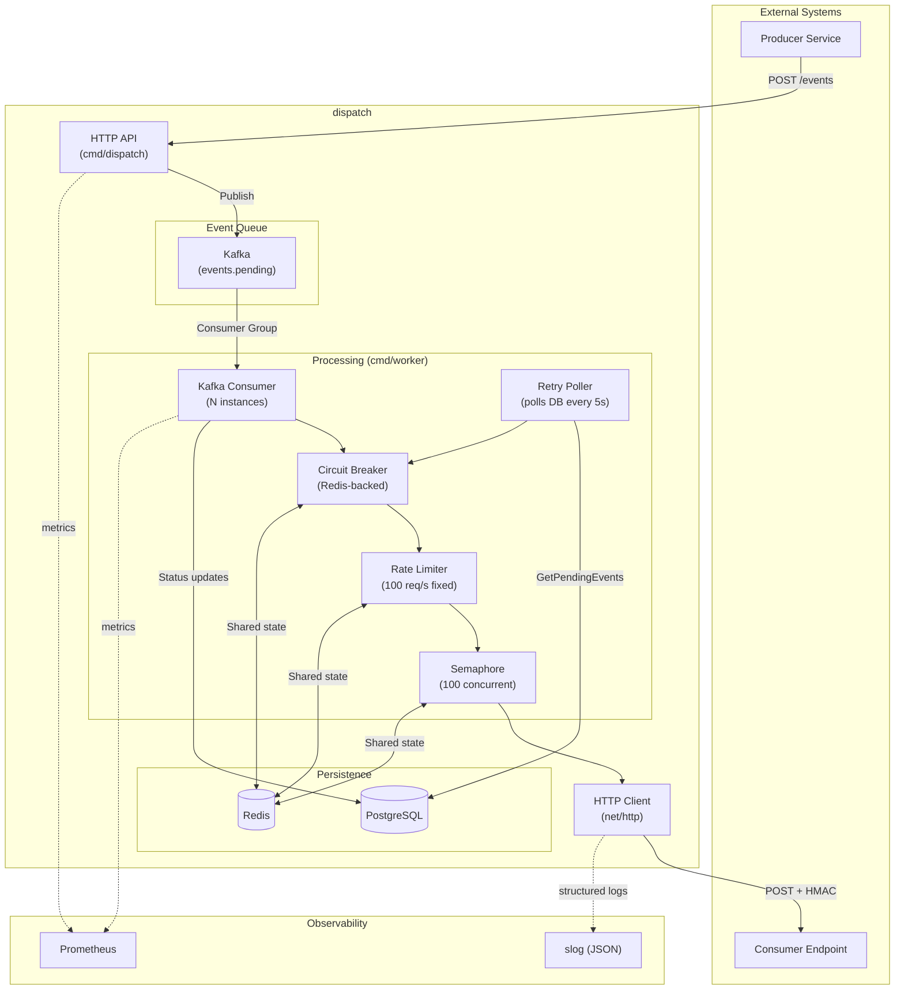

## Components

### HTTP API

Responsible for receiving events and managing subscriptions.

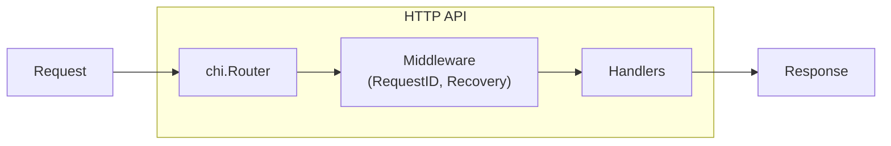

**Endpoints:**

| Method | Path | Handler |
|--------|------|---------|
| POST | /events | CreateEvent |
| GET | /events/{id} | GetEvent |
| GET | /events/{id}/attempts | GetEventAttempts |
| POST | /subscriptions | CreateSubscription |
| GET | /subscriptions | GetSubscriptions |
| DELETE | /subscriptions/{id} | DeleteSubscription |
| GET | /health | Health |

### PostgreSQL Storage

Stores events, delivery attempts, and subscriptions.

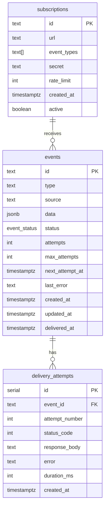

### Worker Process

The worker runs two concurrent components:
1. **Kafka Consumer** — processes new events from Kafka topic
2. **Retry Poller** — polls database for events that need retry

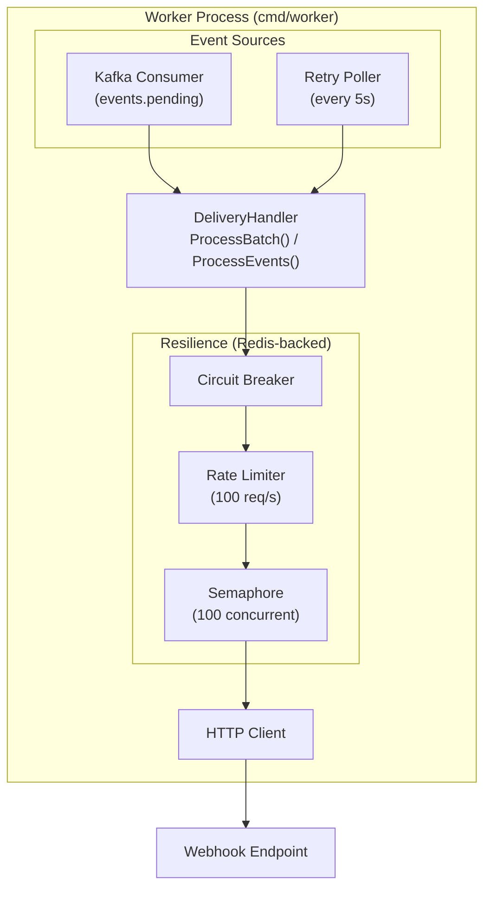

### Delivery Sequence

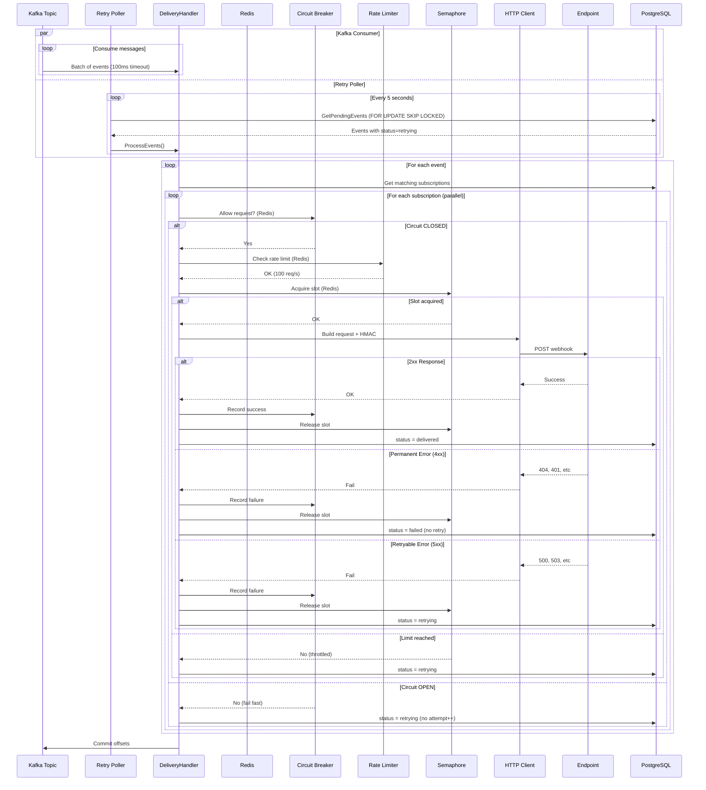

### Retry Policy

Exponential backoff strategy with jitter.

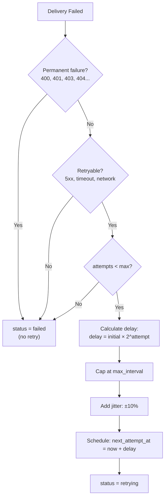

**Default configuration:**

| Parameter | Value |
|-----------|-------|
| InitialInterval | 1s |
| MaxInterval | 1h |
| Multiplier | 2.0 |
| Jitter | 10% |
| MaxAttempts | 5 |

**Example delays:**

| Attempt | Base Delay | With Jitter (±10%) |
|---------|------------|-------------------|
| 1 | 1s | 0.9s - 1.1s |
| 2 | 2s | 1.8s - 2.2s |
| 3 | 4s | 3.6s - 4.4s |
| 4 | 8s | 7.2s - 8.8s |
| 5 | 16s | 14.4s - 17.6s |

### Circuit Breaker

Protects problematic endpoints using the circuit breaker pattern.

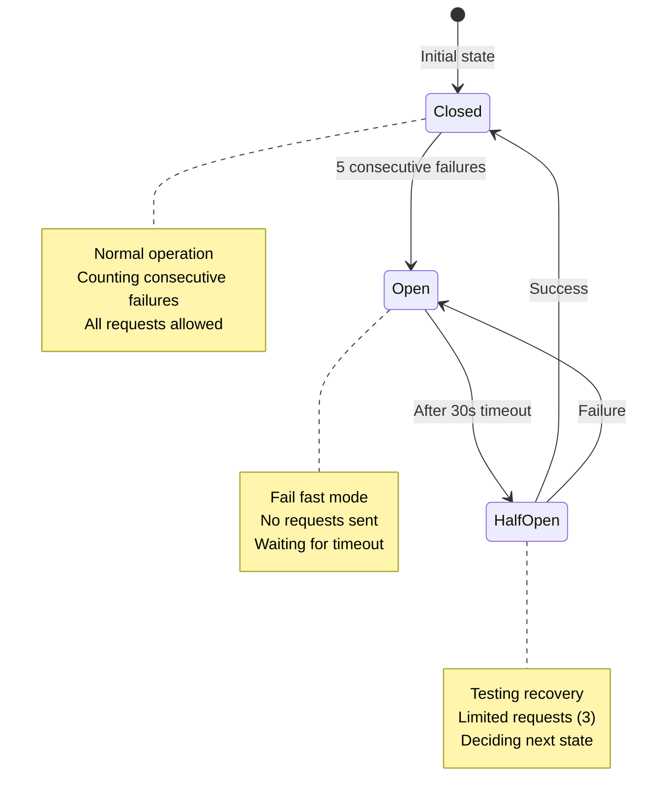

**Behavior by state:**

| State | Requests | Failures | Timeout |
|-------|----------|----------|---------|
| Closed | All allowed | Counting | - |
| Open | Rejected (fail fast) | - | 30s |
| HalfOpen | 3 allowed | Any → Open | - |

**Important decision:** When the circuit is open, the event **does not consume an attempt**. This is fair because the problem is with the destination, not the event.

## Data Flow

### Event Creation

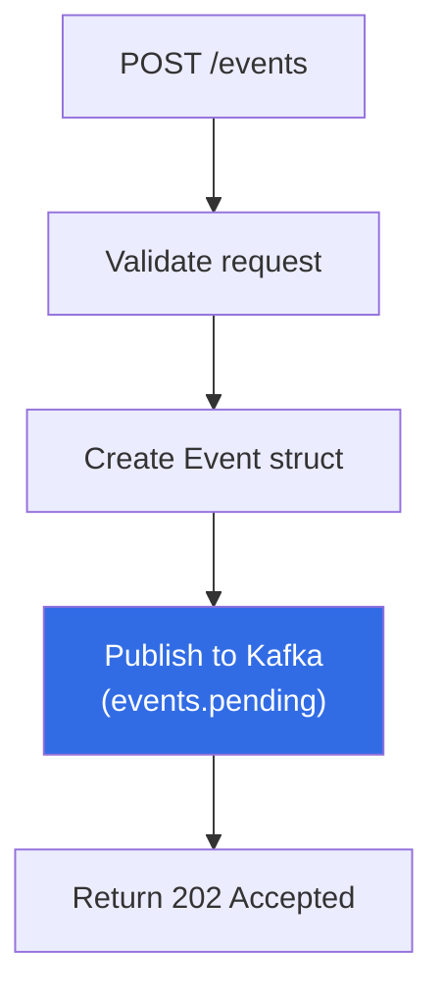

### Webhook Delivery

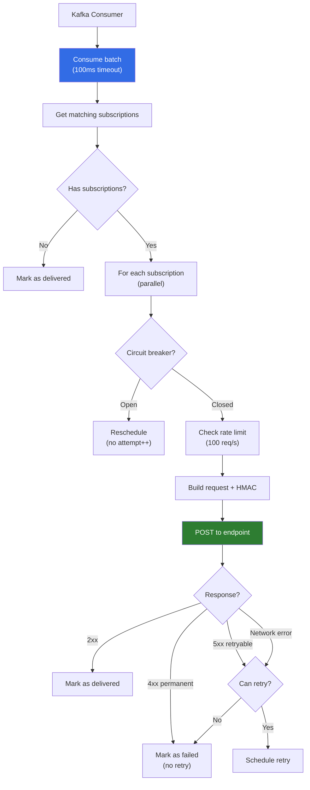

## Concurrency

### Kafka Consumer Groups

Multiple workers can run in parallel via Kafka consumer groups:

- Each worker instance joins the same consumer group (`dispatch-workers`)
- Kafka assigns partitions to workers automatically
- Each partition is processed by exactly one worker
- Adding workers automatically rebalances partitions

### Distributed Semaphore

**Redis-backed semaphore** controls concurrency across all workers:

```go
// Distributed semaphore (Redis)
if h.semaphore != nil {
    acquired, _ := h.semaphore.Acquire(ctx, sub.ID)
    if !acquired {
        return outcomeRetry // Limit reached
    }
    defer h.semaphore.Release(ctx, sub.ID)
}
```

**Features:**
- Coordinates across all worker instances
- Default: 100 concurrent requests per subscription
- TTL-based auto-release (30s) prevents deadlocks
- Falls back to local semaphore if Redis unavailable

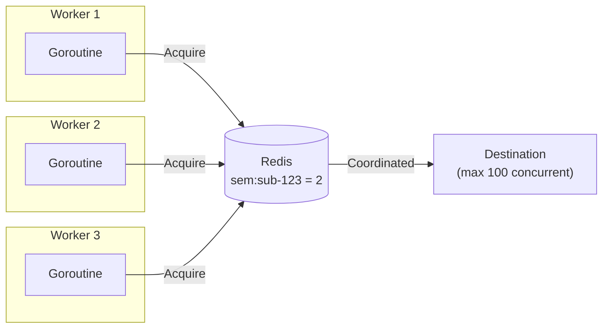

### Graceful Shutdown

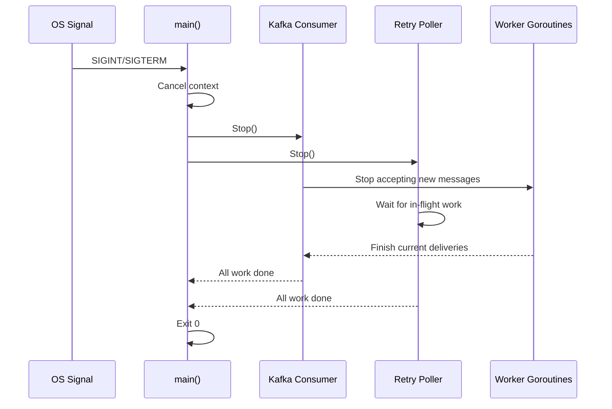

## Retry Flow

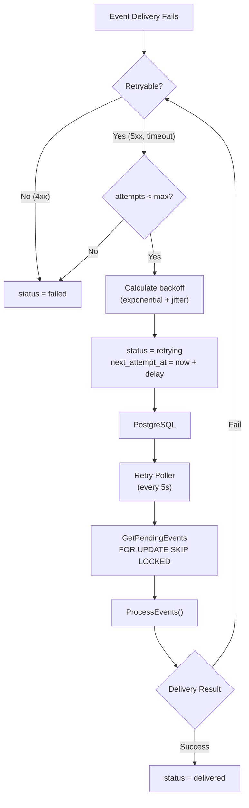

## ADR References

| ADR | Topic |
|-----|-------|
| [ADR-011](adr/011-redis-horizontal-scaling.md) | Redis for distributed state |
| [ADR-012](adr/012-kafka-event-queue.md) | Kafka for event queue |
| [ADR-013](adr/013-retry-poller-distributed-semaphore.md) | Retry poller and distributed semaphore |
