# Arquitetura — Dispatch

Documentação técnica detalhada da arquitetura do Webhook Dispatcher.

## Visão Geral

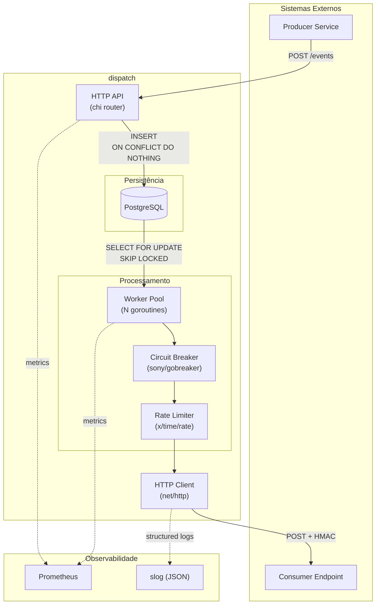

## Componentes

### HTTP API

Responsável por receber eventos e gerenciar subscriptions.

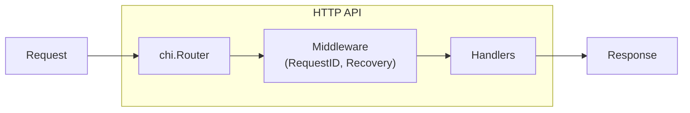

**Endpoints:**

| Método | Path | Handler |
|--------|------|---------|
| POST | /events | CreateEvent |
| GET | /events/{id} | GetEvent |
| GET | /events/{id}/attempts | GetEventAttempts |
| POST | /subscriptions | CreateSubscription |
| GET | /subscriptions | GetSubscriptions |
| DELETE | /subscriptions/{id} | DeleteSubscription |
| GET | /health | Health |

### PostgreSQL Storage

Armazena eventos, tentativas de entrega e subscriptions.

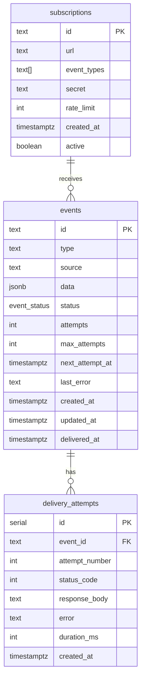

### Worker Pool

Pool de goroutines que fazem polling no banco e processam eventos.

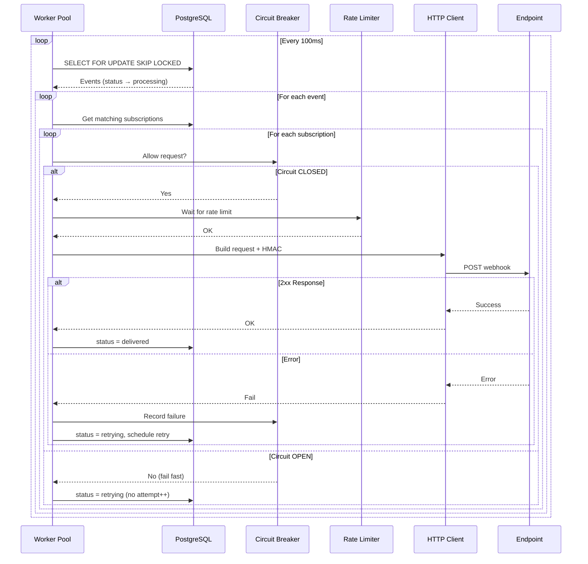

### Retry Policy

Estratégia de backoff exponencial com jitter.

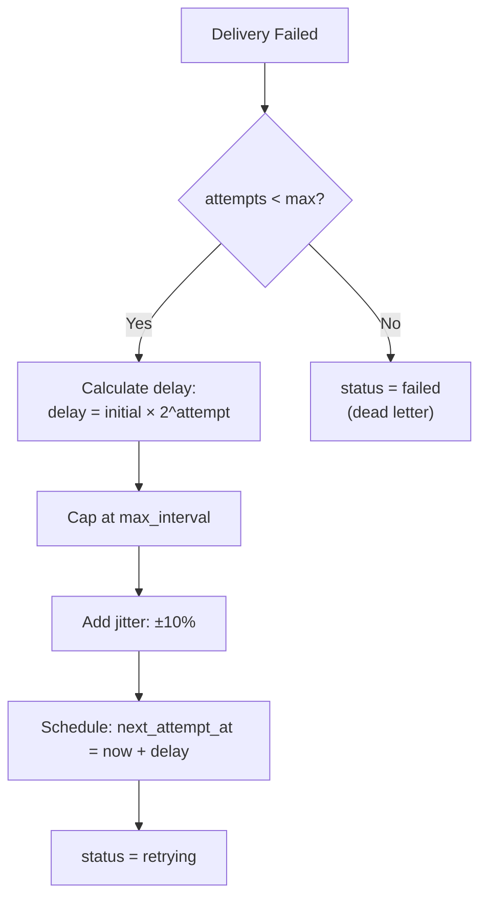

**Configuração padrão:**

| Parâmetro | Valor |
|-----------|-------|
| InitialInterval | 1s |
| MaxInterval | 1h |
| Multiplier | 2.0 |
| Jitter | 10% |
| MaxAttempts | 5 |

**Exemplo de delays:**

| Attempt | Base Delay | Com Jitter (±10%) |
|---------|------------|-------------------|
| 1 | 1s | 0.9s - 1.1s |
| 2 | 2s | 1.8s - 2.2s |
| 3 | 4s | 3.6s - 4.4s |
| 4 | 8s | 7.2s - 8.8s |
| 5 | 16s | 14.4s - 17.6s |

### Circuit Breaker

Protege endpoints com problemas usando o padrão circuit breaker.

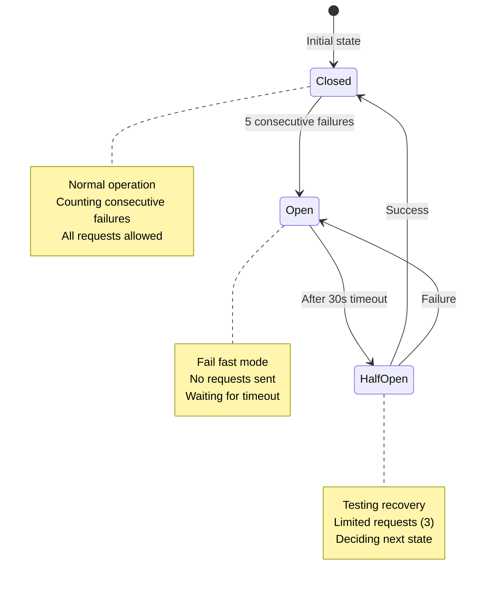

**Comportamento por estado:**

| Estado | Requests | Failures | Timeout |
|--------|----------|----------|---------|
| Closed | Todos permitidos | Contando | - |
| Open | Rejeitados (fail fast) | - | 30s |
| HalfOpen | 3 permitidos | Qualquer → Open | - |

**Decisão importante:** Quando o circuito está aberto, o evento **não consome tentativa**. Isso é justo porque o problema é do destino, não do evento.

## Fluxo de Dados

### Criação de Evento

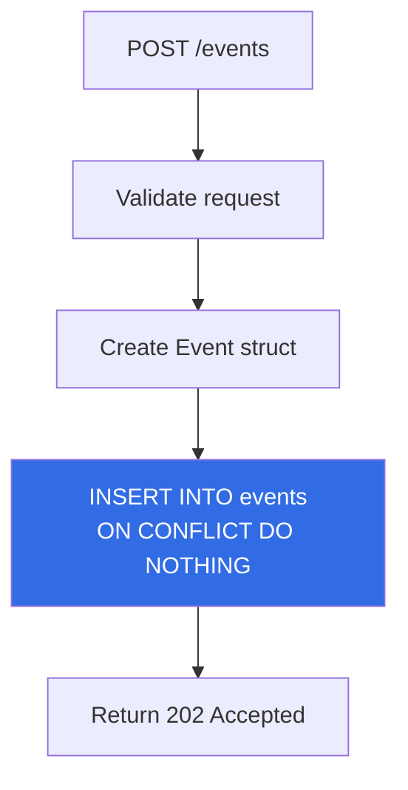

### Entrega de Webhook

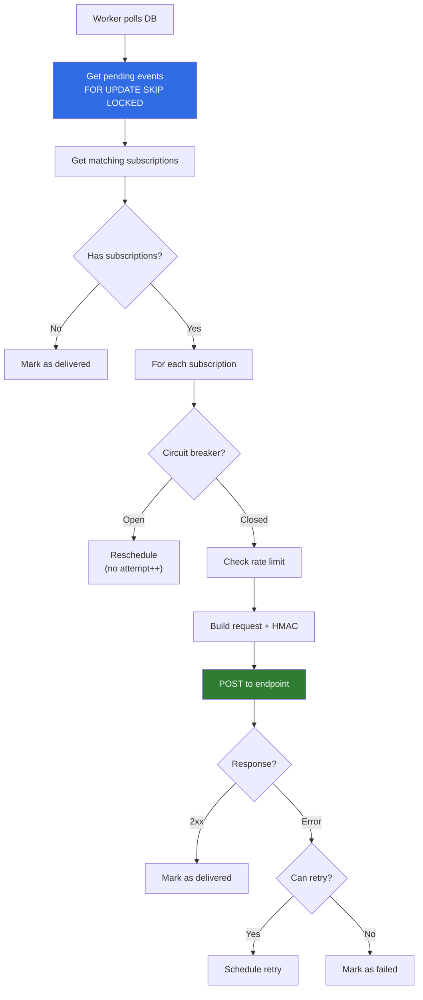

## Concorrência

### Polling Seguro

Múltiplos workers podem rodar em paralelo sem processar o mesmo evento:

```sql
UPDATE events
SET status = 'processing', updated_at = NOW()
WHERE id IN (
    SELECT id FROM events
    WHERE status IN ('pending', 'retrying')
    AND (next_attempt_at IS NULL OR next_attempt_at <= NOW())
    ORDER BY next_attempt_at NULLS FIRST, created_at
    FOR UPDATE SKIP LOCKED
    LIMIT 10
)
RETURNING *
```

**`FOR UPDATE SKIP LOCKED`** garante que:
- Eventos já sendo processados são ignorados
- Não há deadlocks entre workers
- Escala horizontalmente (múltiplas instâncias)

### Graceful Shutdown

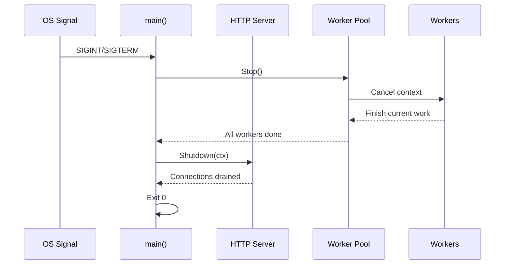

## Evolução Futura

### v0.2.0 — Observabilidade

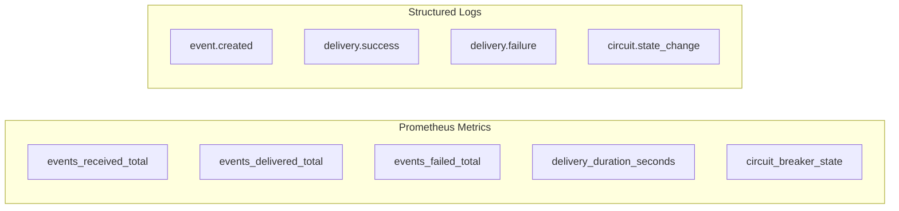

### v0.3.0 — Resiliência

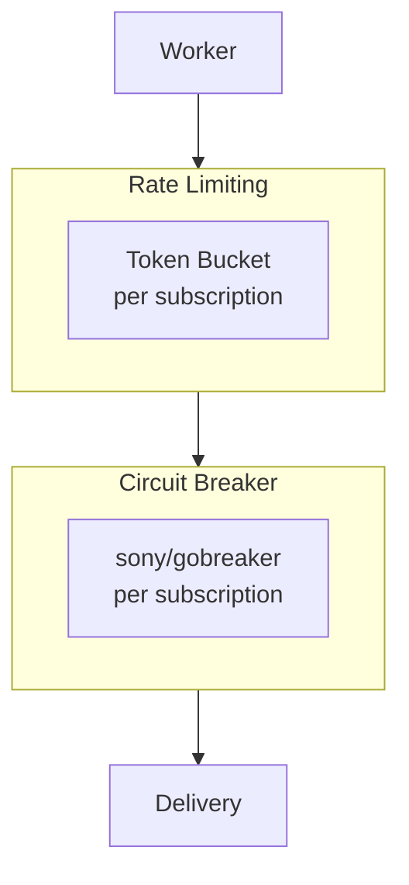
