# Architecture — Dispatch

Detailed technical documentation of the Webhook Dispatcher architecture.

## Overview

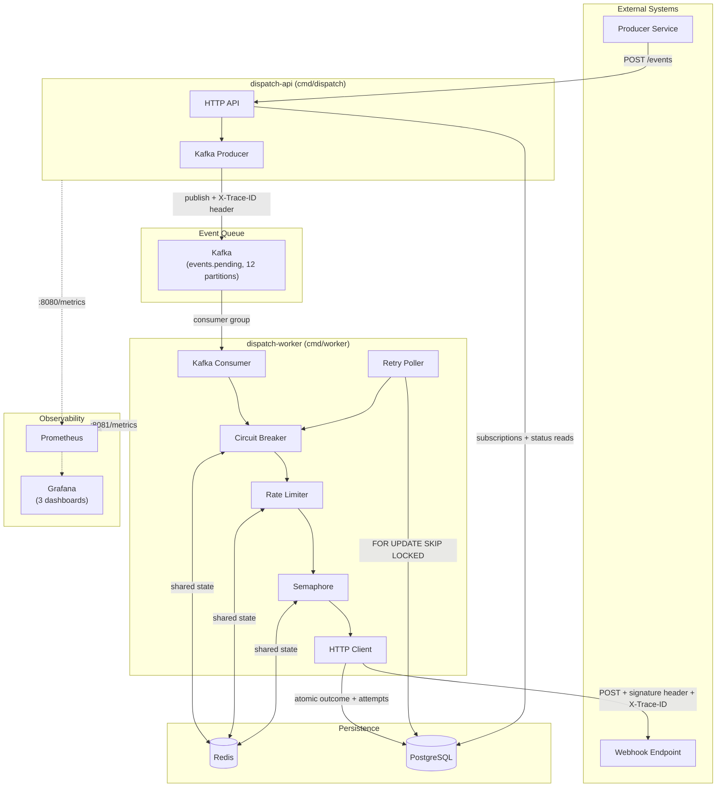
```mermaid
flowchart TB
    subgraph External["External Systems"]
        Producer["Producer Service"]
        Consumer["Webhook Endpoint"]
    end

    subgraph API["dispatch-api (cmd/dispatch)"]
        direction TB
        HTTPHandler["HTTP API"]
        KafkaProducer["Kafka Producer"]
    end

    subgraph Queue["Event Queue"]
        Kafka["Kafka<br/>(events.pending, 12 partitions)"]
    end

    subgraph Worker["dispatch-worker (cmd/worker)"]
        direction TB
        KafkaConsumer["Kafka Consumer"]
        RetryPoller["Retry Poller"]
        CB["Circuit Breaker"]
        RL["Rate Limiter"]
        Sem["Semaphore"]
        Delivery["HTTP Client"]
    end

    subgraph Storage["Persistence"]
        DB[(PostgreSQL)]
        Redis[(Redis)]
    end

    subgraph Observability["Observability"]
        Prom["Prometheus"]
        Grafana["Grafana<br/>(3 dashboards)"]
    end

    Producer -->|"POST /events"| HTTPHandler
    HTTPHandler -->|"subscriptions + status reads"| DB
    HTTPHandler --> KafkaProducer
    KafkaProducer -->|"publish + X-Trace-ID header"| Kafka
    Kafka -->|"consumer group"| KafkaConsumer
    RetryPoller -->|"FOR UPDATE SKIP LOCKED"| DB
    KafkaConsumer --> CB
    RetryPoller --> CB
    CB --> RL
    RL --> Sem
    Sem --> Delivery
    Delivery -->|"POST + signature header + X-Trace-ID"| Consumer
    Delivery -->|"atomic outcome + attempts"| DB
    CB <-->|"shared state"| Redis
    RL <-->|"shared state"| Redis
    Sem <-->|"shared state"| Redis

    API -.->|":8080/metrics"| Prom
    Worker -.->|":8081/metrics"| Prom
    Prom -.-> Grafana
```

### Scaling Constraints

| Service | HPA min | HPA max | Constraint |
|---------|---------|---------|------------|
| `dispatch-api` | 2 | 20 | CPU/memory (stateless) |
| `dispatch-worker` | 2 | **12** | Kafka partition count |

## Components

### HTTP API

Responsible for receiving events and managing subscriptions.

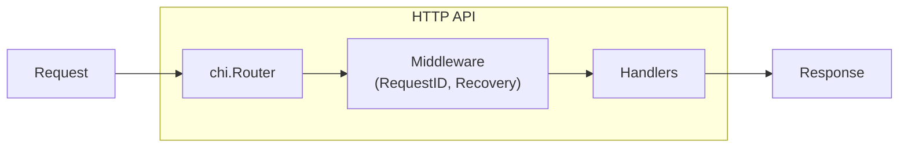
```mermaid
flowchart LR
    subgraph API["HTTP API"]
        Router["chi.Router"]
        Middleware["Middleware<br/>(RequestID, Recovery)"]
        Handlers["Handlers"]
    end

    Request --> Router
    Router --> Middleware
    Middleware --> Handlers
    Handlers --> Response
```

**Endpoints:**

| Method | Path | Handler |
|--------|------|---------|
| POST | /events | CreateEvent |
| GET | /events/{id} | GetEvent |
| GET | /events/{id}/attempts | GetEventAttempts |
| POST | /subscriptions | CreateSubscription |
| GET | /subscriptions | GetSubscriptions |
| DELETE | /subscriptions/{id} | DeleteSubscription |
| GET | /health | Health (liveness) |
| GET | /ready | Ready (readiness) |

### PostgreSQL Storage

Stores events, delivery attempts, and subscriptions.

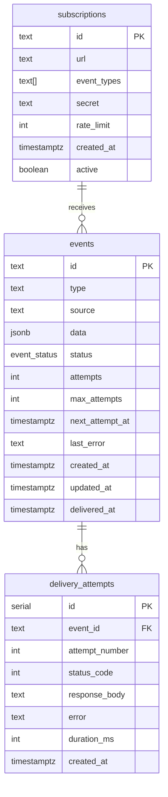
```mermaid
erDiagram
    events ||--o{ delivery_attempts : has
    subscriptions ||--o{ events : receives

    events {
        text id PK
        text type
        text source
        jsonb data
        event_status status
        int attempts
        int max_attempts
        timestamptz next_attempt_at
        text last_error
        timestamptz created_at
        timestamptz updated_at
        timestamptz delivered_at
    }

    delivery_attempts {
        serial id PK
        text event_id FK
        int attempt_number
        int status_code
        text response_body
        text error
        int duration_ms
        timestamptz created_at
    }

    subscriptions {
        text id PK
        text url
        text[] event_types
        text secret
        int rate_limit
        timestamptz created_at
        boolean active
    }
```

### Worker Process

The worker runs two concurrent components:
1. **Kafka Consumer** — processes new events from Kafka topic
2. **Retry Poller** — polls database for events that need retry

For Kafka-originated events, the handler performs the webhook call and then persists the
event outcome and all generated attempt rows in one PostgreSQL transaction. The consumer
commits Kafka offsets only after that transaction succeeds. A failed transaction leaves
the Kafka batch uncommitted, so it can be redelivered.

This is an at-least-once boundary, not exactly-once delivery. If the webhook succeeds but
the database transaction fails, Kafka redelivery can call the destination again.

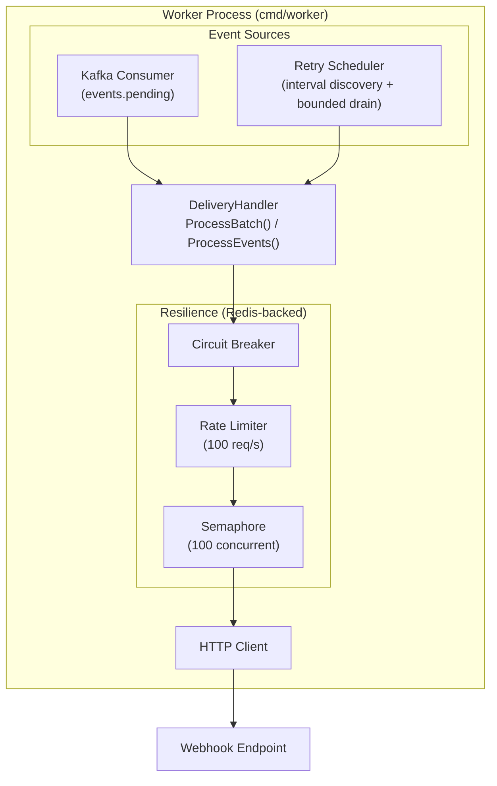
```mermaid
flowchart TB
    subgraph Worker["Worker Process (cmd/worker)"]
        subgraph Sources["Event Sources"]
            Kafka["Kafka Consumer<br/>(events.pending)"]
            Poller["Retry Scheduler<br/>(interval discovery + bounded drain)"]
        end
        
        Handler["DeliveryHandler<br/>ProcessBatch() / ProcessEvents()"]
        
        subgraph Resilience["Resilience (Redis-backed)"]
            CB["Circuit Breaker"]
            RL["Rate Limiter<br/>(100 req/s)"]
            Sem["Semaphore<br/>(100 concurrent)"]
        end
        
        HTTP["HTTP Client"]
    end
    
    Kafka --> Handler
    Poller --> Handler
    Handler --> CB
    CB --> RL
    RL --> Sem
    Sem --> HTTP
    HTTP --> Endpoint["Webhook Endpoint"]
```

### Delivery Sequence

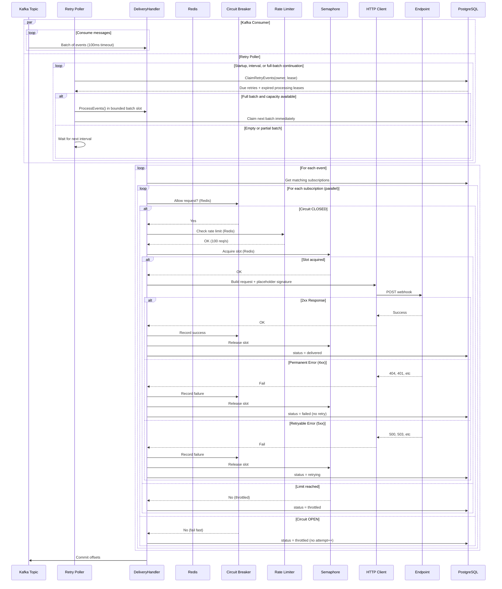
```mermaid
sequenceDiagram
    participant Kafka as Kafka Topic
    participant Poller as Retry Poller
    participant Worker as DeliveryHandler
    participant Redis as Redis
    participant CB as Circuit Breaker
    participant RL as Rate Limiter
    participant Sem as Semaphore
    participant HTTP as HTTP Client
    participant Endpoint
    participant DB as PostgreSQL

    par Kafka Consumer
        loop Consume messages
            Kafka->>Worker: Batch of events (100ms timeout)
        end
    and Retry Poller
        loop Startup, interval, or full-batch continuation
            Poller->>DB: ClaimRetryEvents(owner, lease)
            DB-->>Poller: Due retries + expired processing leases
            alt Full batch and capacity available
                Poller->>Worker: ProcessEvents() in bounded batch slot
                Poller->>DB: Claim next batch immediately
            else Empty or partial batch
                Poller->>Poller: Wait for next interval
            end
        end
    end
    
    loop For each event
        Worker->>DB: Get matching subscriptions
        
        loop For each subscription (parallel)
            Worker->>CB: Allow request? (Redis)
            
            alt Circuit CLOSED
                CB-->>Worker: Yes
                Worker->>RL: Check rate limit (Redis)
                RL-->>Worker: OK (100 req/s)
                Worker->>Sem: Acquire slot (Redis)
                
                alt Slot acquired
                    Sem-->>Worker: OK
                    Worker->>HTTP: Build request + placeholder signature
                    HTTP->>Endpoint: POST webhook
                    
                    alt 2xx Response
                        Endpoint-->>HTTP: Success
                        HTTP-->>Worker: OK
                        Worker->>CB: Record success
                        Worker->>Sem: Release slot
                        Worker->>DB: status = delivered
                    else Permanent Error (4xx)
                        Endpoint-->>HTTP: 404, 401, etc
                        HTTP-->>Worker: Fail
                        Worker->>CB: Record failure
                        Worker->>Sem: Release slot
                        Worker->>DB: status = failed (no retry)
                    else Retryable Error (5xx)
                        Endpoint-->>HTTP: 500, 503, etc
                        HTTP-->>Worker: Fail
                        Worker->>CB: Record failure
                        Worker->>Sem: Release slot
                        Worker->>DB: status = retrying
                    end
                else Limit reached
                    Sem-->>Worker: No (throttled)
                    Worker->>DB: status = throttled
                end
                
            else Circuit OPEN
                CB-->>Worker: No (fail fast)
                Worker->>DB: status = throttled (no attempt++)
            end
        end
    end
    
    Worker->>Kafka: Commit offsets
```

### Retry Policy

Exponential backoff strategy with jitter.

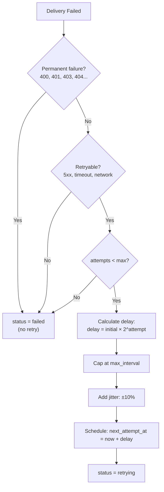
```mermaid
flowchart TD
    Start["Delivery Failed"] --> CheckPermanent{Permanent failure?<br/>400, 401, 403, 404...}
    
    CheckPermanent -->|Yes| Failed["status = failed<br/>(no retry)"]
    CheckPermanent -->|No| CheckRetryable{Retryable?<br/>5xx, timeout, network}
    
    CheckRetryable -->|No| Failed
    CheckRetryable -->|Yes| CanRetry{attempts < max?}
    
    CanRetry -->|Yes| Calculate["Calculate delay:<br/>delay = initial × 2^attempt"]
    Calculate --> Cap["Cap at max_interval"]
    Cap --> Jitter["Add jitter: ±10%"]
    Jitter --> Schedule["Schedule: next_attempt_at = now + delay"]
    Schedule --> Status["status = retrying"]
    
    CanRetry -->|No| Failed
```

**Default configuration:**

| Parameter | Value |
|-----------|-------|
| InitialInterval | 1s |
| MaxInterval | 1h |
| Multiplier | 2.0 |
| Jitter | 10% |
| MaxAttempts | 5 |

**Example delays:**

| Attempt | Base Delay | With Jitter (±10%) |
|---------|------------|-------------------|
| 1 | 1s | 0.9s - 1.1s |
| 2 | 2s | 1.8s - 2.2s |
| 3 | 4s | 3.6s - 4.4s |
| 4 | 8s | 7.2s - 8.8s |
| 5 | 16s | 14.4s - 17.6s |

### Circuit Breaker

Protects problematic endpoints using the circuit breaker pattern.

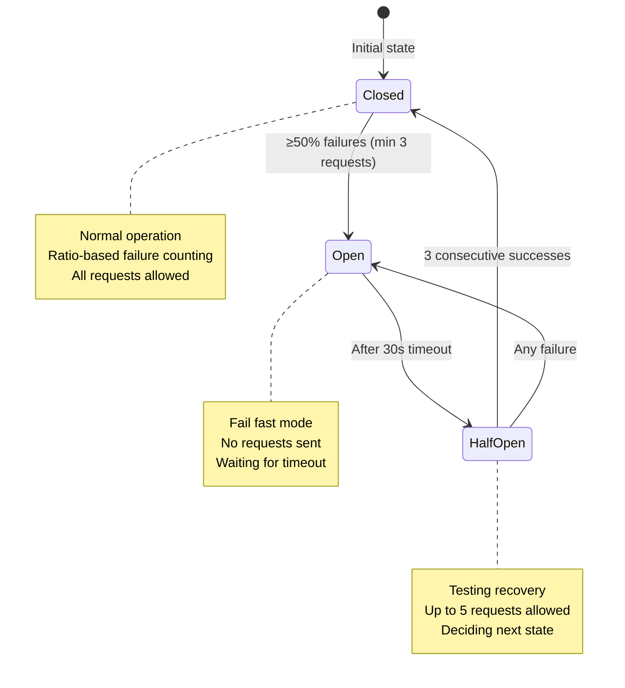
```mermaid
stateDiagram-v2
    [*] --> Closed: Initial state
    
    Closed --> Open: ≥50% failures (min 3 requests)
    Open --> HalfOpen: After 30s timeout
    HalfOpen --> Closed: 3 consecutive successes
    HalfOpen --> Open: Any failure
    
    note right of Closed
        Normal operation
        Ratio-based failure counting
        All requests allowed
    end note
    
    note right of Open
        Fail fast mode
        No requests sent
        Waiting for timeout
    end note
    
    note right of HalfOpen
        Testing recovery
        Up to 5 requests allowed
        Deciding next state
    end note
```

**Behavior by state:**

| State | Requests | Trips when | Timeout |
|-------|----------|------------|---------|
| Closed | All allowed | ≥50% failure rate (min 3 requests) | - |
| Open | Rejected (fail fast) | - | 30s |
| HalfOpen | Up to 5 allowed | Any failure → Open; 3 successes → Closed | - |

**Important decision:** When the circuit is open, the event **does not consume an attempt**. This is fair because the problem is with the destination, not the event.

**Observability hook:** Both `RedisCircuitBreaker` and `SimpleCircuitBreaker` implement the `StateChangeNotifier` interface (`internal/resilience/interfaces.go`). The `DeliveryHandler` type-asserts the circuit breaker to this interface at construction (via `WithCircuitBreakerMetrics` option) and registers a callback that updates the `dispatch_worker_circuit_breaker_state` gauge (0/1/2) and increments `dispatch_worker_circuit_breaker_trips_total` on each transition to open. The `CircuitBreaker` interface itself is unaffected — observability is opt-in.

## Data Flow

### Event Creation

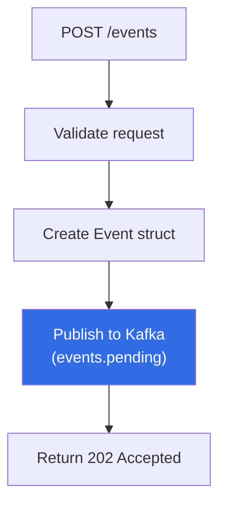
```mermaid
flowchart TD
    A["POST /events"] --> B["Validate request"]
    B --> C["Create Event struct"]
    C --> D["Publish to Kafka<br/>(events.pending)"]
    D --> E["Return 202 Accepted"]
    
    style D fill:#326ce5,color:#fff
```

### Webhook Delivery

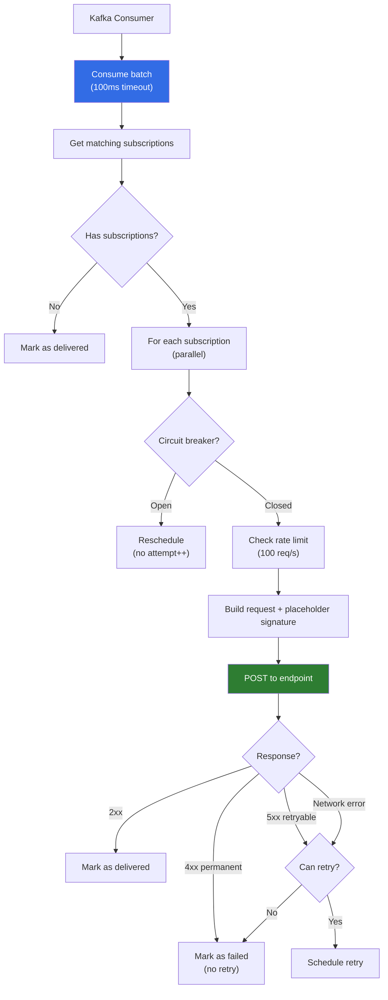
```mermaid
flowchart TD
    A["Kafka Consumer"] --> B["Consume batch<br/>(100ms timeout)"]
    B --> C["Get matching subscriptions"]
    C --> D{"Has subscriptions?"}
    
    D -->|No| E["Mark as delivered"]
    D -->|Yes| F["For each subscription<br/>(parallel)"]
    
    F --> G{"Circuit breaker?"}
    G -->|Open| H["Reschedule<br/>(no attempt++)"]
    G -->|Closed| I["Check rate limit<br/>(100 req/s)"]
    
    I --> J["Build request + placeholder signature"]
    J --> K["POST to endpoint"]
    
    K --> L{"Response?"}
    L -->|2xx| M["Mark as delivered"]
    L -->|4xx permanent| P["Mark as failed<br/>(no retry)"]
    L -->|5xx retryable| N{"Can retry?"}
    L -->|Network error| N
    
    N -->|Yes| O["Schedule retry"]
    N -->|No| P
    
    style B fill:#326ce5,color:#fff
    style K fill:#2e7d32,color:#fff
```

## Concurrency

### Kafka Consumer Groups

Multiple workers can run in parallel via Kafka consumer groups:

- Each worker instance joins the same consumer group (`dispatch-workers`)
- Kafka assigns partitions to workers automatically
- Each partition is processed by exactly one worker
- Adding workers automatically rebalances partitions

### Distributed Semaphore

**Redis-backed semaphore** controls concurrency across all workers:

```go
// Distributed semaphore (Redis)
if h.semaphore != nil {
    acquired, _ := h.semaphore.Acquire(ctx, sub.ID)
    if !acquired {
        return outcomeRetry // Limit reached
    }
    defer h.semaphore.Release(ctx, sub.ID)
}
```

**Features:**
- Coordinates across all worker instances
- Default: 100 concurrent requests per subscription
- TTL-based auto-release (30s) prevents deadlocks
- Falls back to local semaphore if Redis unavailable

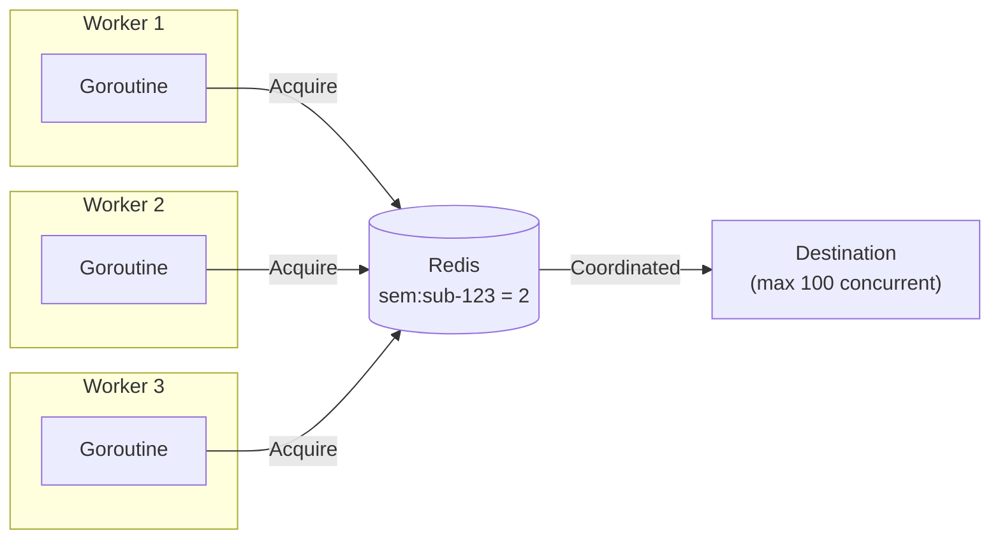
```mermaid
flowchart LR
    subgraph Worker1["Worker 1"]
        G1["Goroutine"]
    end
    subgraph Worker2["Worker 2"]
        G2["Goroutine"]
    end
    subgraph Worker3["Worker 3"]
        G3["Goroutine"]
    end
    
    G1 -->|"Acquire"| Redis[("Redis<br/>sem:sub-123 = 2")]
    G2 -->|"Acquire"| Redis
    G3 -->|"Acquire"| Redis
    
    Redis -->|"Coordinated"| Endpoint["Destination<br/>(max 100 concurrent)"]
```

### Graceful Shutdown

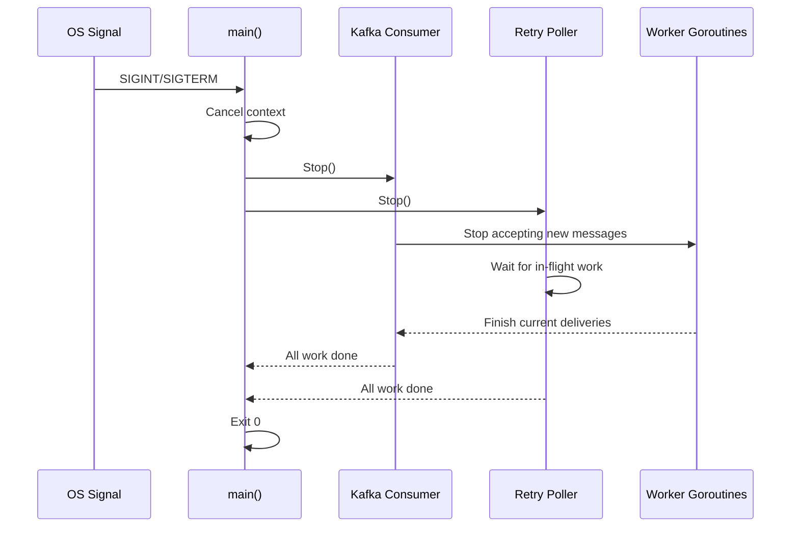
```mermaid
sequenceDiagram
    participant Signal as OS Signal
    participant Main as main()
    participant Consumer as Kafka Consumer
    participant Poller as Retry Poller
    participant Workers as Worker Goroutines

    Signal->>Main: SIGINT/SIGTERM
    Main->>Main: Cancel context
    Main->>Consumer: Stop()
    Main->>Poller: Stop()
    Consumer->>Workers: Stop accepting new messages
    Poller->>Poller: Wait for in-flight work
    Workers-->>Consumer: Finish current deliveries
    Consumer-->>Main: All work done
    Poller-->>Main: All work done
    Main->>Main: Exit 0
```

## Retry Flow

The scheduler has one claim coordinator per worker. It is the only component that starts
drain cycles, so ticker events cannot create overlapping claim loops. Processing slots are
bounded by `RETRY_MAX_CONCURRENT_BATCHES`; each claimed batch owns one slot until
`ProcessEvents` returns. Full claims keep the drain cycle active, while partial and empty
claims are evidence that immediate work has been exhausted.

The poll interval therefore bounds idle discovery latency. Retry throughput depends on
batch size, concurrent batch slots, database pool capacity, receiver latency, and the
per-subscription resilience controls.

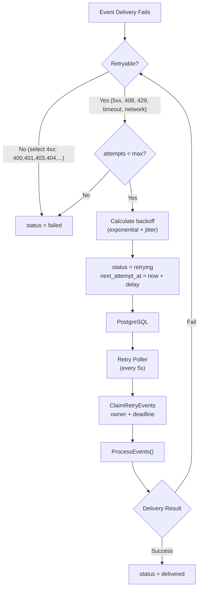
```mermaid
flowchart TD
    A["Event Delivery Fails"] --> B{"Retryable?"}
    B -->|"No (select 4xx: 400,401,403,404,...)"| C["status = failed"]
    B -->|"Yes (5xx, 408, 429, timeout, network)"| D{"attempts < max?"}
    D -->|"No"| C
    D -->|"Yes"| E["Calculate backoff<br/>(exponential + jitter)"]
    E --> F["status = retrying<br/>next_attempt_at = now + delay"]
    F --> G["PostgreSQL"]
    G --> H["Retry Poller<br/>(every 5s)"]
    H --> I["ClaimRetryEvents<br/>owner + deadline"]
    I --> J["ProcessEvents()"]
    J --> K{"Delivery Result"}
    K -->|"Success"| L["status = delivered"]
    K -->|"Fail"| B
```

Retry claims are durable leases. PostgreSQL atomically selects due `retrying`/`throttled`
events or expired `processing` events, then stores the worker `INSTANCE_ID` and a deadline.
Outcome persistence matches event ID, owner, and exact deadline before clearing lease metadata.
This deadline match fences an older lease even if the same instance ID later reclaims the event.

### Persistence and Commit Boundary

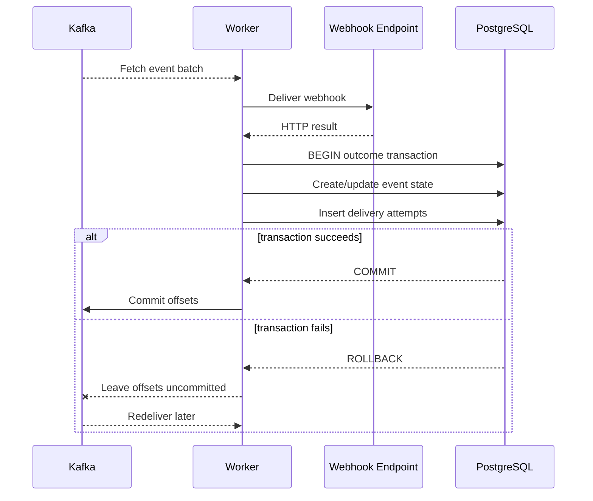
```mermaid
sequenceDiagram
    participant K as Kafka
    participant W as Worker
    participant E as Webhook Endpoint
    participant DB as PostgreSQL

    K-->>W: Fetch event batch
    W->>E: Deliver webhook
    E-->>W: HTTP result
    W->>DB: BEGIN outcome transaction
    W->>DB: Create/update event state
    W->>DB: Insert delivery attempts
    alt transaction succeeds
        DB-->>W: COMMIT
        W->>K: Commit offsets
    else transaction fails
        DB-->>W: ROLLBACK
        W--xK: Leave offsets uncommitted
        K-->>W: Redeliver later
    end
```

## ADR References

| ADR | Topic |
|-----|-------|
| [ADR-011](adr/011-redis-horizontal-scaling.md) | Redis for distributed state |
| [ADR-012](adr/012-kafka-event-queue.md) | Kafka for event queue |
| [ADR-013](adr/013-retry-poller-distributed-semaphore.md) | Retry poller and distributed semaphore |
| [ADR-015](adr/015-atomic-outcome-persistence.md) | Atomic outcome persistence and Kafka commit safety |
| [ADR-016](adr/016-owner-fenced-retry-leases.md) | Owner-fenced retry claim leases |
