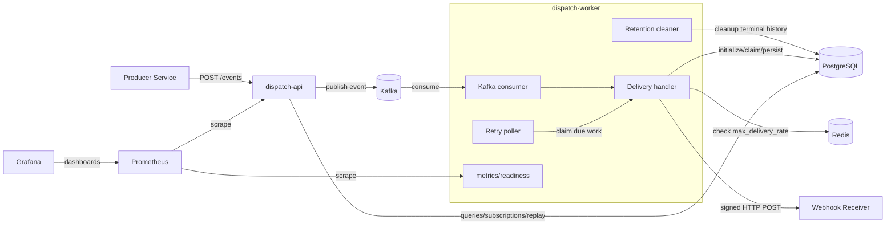
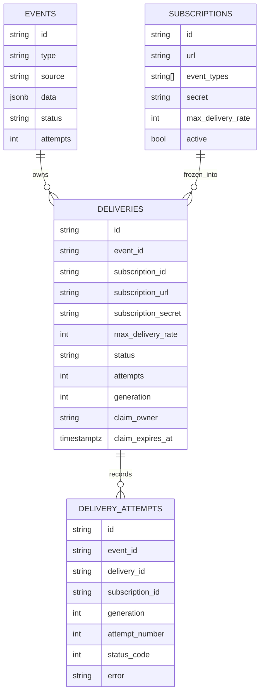
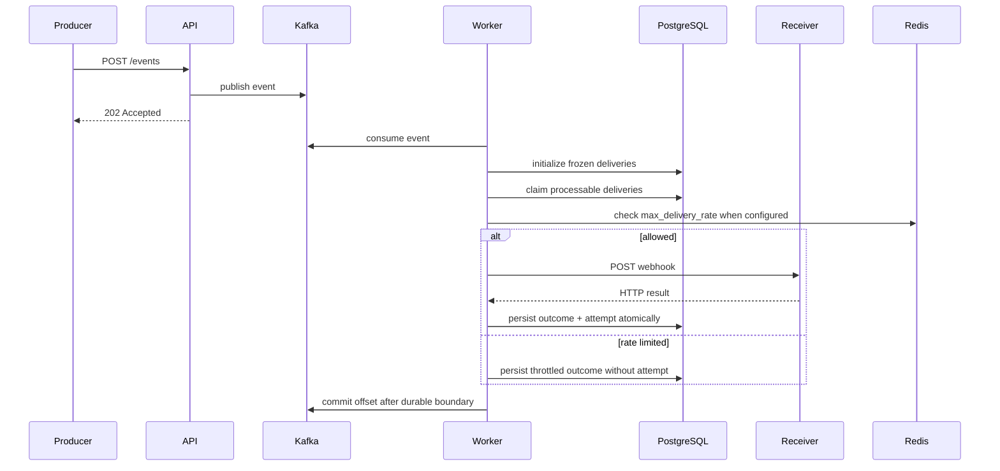

# Dispatch Architecture

> **Authority:** This document explains the current implementation structure. Product purpose
> belongs in [product.md](product.md); observable behavior belongs in [spec.md](spec.md);
> historical rationale belongs in [adr/](adr/).

## System View

Dispatch is split into an HTTP API and a worker. Kafka is the asynchronous boundary between event
acceptance and webhook delivery. PostgreSQL is the durable source of truth for events, deliveries,
attempts, retry leases, replay generations, and retention cleanup.

```mermaid
flowchart LR
    Producer[Producer Service] -->|POST /events| API[dispatch-api]
    API -->|publish event| Kafka[(Kafka)]

    subgraph WorkerRuntime[dispatch-worker]
        Consumer[Kafka consumer]
        Retry[Retry poller]
        Delivery[Delivery handler]
        Retention[Retention cleaner]
        WorkerObs[metrics/readiness]
    end

    Kafka -->|consume| Consumer
    Consumer --> Delivery
    Retry -->|claim due work| Delivery
    Retention -->|cleanup terminal history| DB[(PostgreSQL)]
    Delivery -->|initialize/claim/persist| DB
    Delivery -->|check max_delivery_rate| Redis[(Redis)]
    Delivery -->|signed HTTP POST| Receiver[Webhook Receiver]
    API -->|queries/subscriptions/replay| DB
    Prom[Prometheus] -->|scrape| API
    Prom -->|scrape| WorkerObs
    Grafana[Grafana] -->|dashboards| Prom
```

## Runtime Components

| Component | Responsibility |
|-----------|----------------|
| `cmd/dispatch` | Thin API process wrapper |
| `internal/app/api.go` | API assembly, PostgreSQL/Kafka wiring, routes, health, metrics |
| `internal/api` | HTTP handlers for events, subscriptions, delivery query, replay, and secret rotation |
| `internal/kafka/producer.go` | Event publication and trace propagation |
| `cmd/worker` | Thin worker process wrapper |
| `internal/app/worker.go` | Worker assembly, delivery handler, consumer, retry poller, retention cleaner, metrics |
| `internal/kafka` | Kafka consumption, delivery initialization, HTTP delivery, retry classification, outcome persistence |
| `internal/retry` | Exponential backoff and bounded retry polling |
| `internal/retention` | Bounded cleanup of attempt bodies and terminal event history |
| `internal/repository/postgres` | PostgreSQL persistence for events, subscriptions, deliveries, attempts, replay, leases, and cleanup |
| `internal/resilience` | Local and Redis-backed per-subscription max-delivery-rate limiters |

## Data Model

The current runtime model is per-delivery. An event is a logical unit submitted by a producer.
A delivery is the durable event/subscription target selected when that event is first initialized.
Attempts are HTTP calls made for a delivery generation.

```mermaid
erDiagram
    EVENTS ||--o{ DELIVERIES : owns
    DELIVERIES ||--o{ DELIVERY_ATTEMPTS : records
    SUBSCRIPTIONS ||--o{ DELIVERIES : frozen_into

    EVENTS {
        string id
        string type
        string source
        jsonb data
        string status
        int attempts
    }

    SUBSCRIPTIONS {
        string id
        string url
        string[] event_types
        string secret
        int max_delivery_rate
        bool active
    }

    DELIVERIES {
        string id
        string event_id
        string subscription_id
        string subscription_url
        string subscription_secret
        int max_delivery_rate
        string status
        int attempts
        int generation
        string claim_owner
        timestamptz claim_expires_at
    }

    DELIVERY_ATTEMPTS {
        string id
        string event_id
        string delivery_id
        string subscription_id
        int generation
        int attempt_number
        int status_code
        string error
    }
```

## Delivery Flow

```mermaid
sequenceDiagram
    participant P as Producer
    participant API as API
    participant K as Kafka
    participant W as Worker
    participant DB as PostgreSQL
    participant R as Receiver

    P->>API: POST /events
    API->>K: publish event
    API-->>P: 202 Accepted
    W->>K: consume event
    W->>DB: initialize frozen deliveries
    W->>DB: claim processable deliveries
    W->>Redis: check max_delivery_rate when configured
    alt allowed
        W->>R: POST webhook
        R-->>W: HTTP result
        W->>DB: persist outcome + attempt atomically
    else rate limited
        W->>DB: persist throttled outcome without attempt
    end
    W->>K: commit offset after durable boundary
```

The worker commits Kafka offsets only after delivery work reaches a durable boundary. If outcome
persistence fails before that boundary, the Kafka batch remains uncommitted and can be consumed
again. Duplicate HTTP calls are accepted by the product contract; receivers deduplicate by event ID
when necessary.

## Retry And Replay

Retry scheduling lives in PostgreSQL. Retryable and throttled deliveries receive `next_attempt_at`.
The retry poller claims due rows with owner/deadline fencing and processes them through the same
delivery handler used by Kafka-originated work.

Replay is failed-delivery scoped. A replay increments the delivery generation, resets the current
generation attempt count, keeps historical attempts, and schedules the normal retry path.

## Destination Protection

Destination protection is deliberately narrow for v1:

- subscriptions expose `max_delivery_rate`;
- delivery rows freeze that value during initialization;
- the worker checks the frozen value before HTTP delivery;
- when Redis is configured, the check uses a Redis sliding window shared by worker instances;
- when Redis is absent, the check uses a local limiter for development and single-worker operation;
- when Redis is configured but unavailable, the decision fails closed as `throttled`;
- rejected checks persist `throttled` and do not write an attempt row.

Circuit breakers, distributed semaphores, and separate burst/concurrency subscription controls are
not part of the current v1 runtime.

## Observability

The API and worker expose Prometheus metrics. Kafka delivery emits lifecycle observations through
`DeliveryObserver`; `internal/app` maps those observations to concrete metric names.

The API and worker also expose shallow liveness and role-specific readiness:

- API readiness checks PostgreSQL and Kafka topic metadata before advertising itself as ready.
- Worker readiness checks PostgreSQL, Kafka topic metadata, and Redis when `REDIS_URL` is
  configured.
- Liveness stays dependency-free so temporary dependency outages do not force process restarts.

Important worker signals include:

- delivered, retrying, failed, and throttled totals;
- HTTP delivery duration and attempt count;
- rate-limit rejections by subscription ID;
- retry claimed/reclaimed events, due backlog, lease age, active batches, scheduling lag, and
  persistence failures;
- retention cleanup duration, redaction/deletion counts, failures, and last success timestamp.

## Scaling Boundaries

The API is stateless aside from PostgreSQL and Kafka dependencies. Worker throughput is bounded by:

- Kafka partitions and consumer group behavior;
- PostgreSQL pool and query plans;
- retry batch size and concurrent retry batches;
- receiver latency and error rate;
- destination `max_delivery_rate`;
- CPU and network capacity of the worker environment.

Speculative distributed coordination should not be added without a measured bottleneck and a new
execution plan.

## Related Decisions

- [ADR 012: Kafka as Event Queue](adr/012-kafka-event-queue.md)
- [ADR 015: Atomic Outcome Persistence and Kafka Commit Safety](adr/015-atomic-outcome-persistence.md)
- [ADR 016: Owner-Fenced Retry Claim Leases](adr/016-owner-fenced-retry-leases.md)
- [ADR 017: Rate-Control Contract Normalization](adr/017-rate-control-contract.md)
