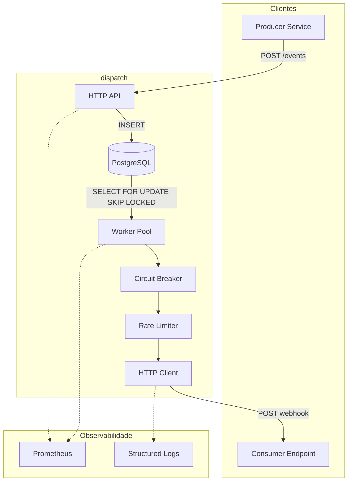
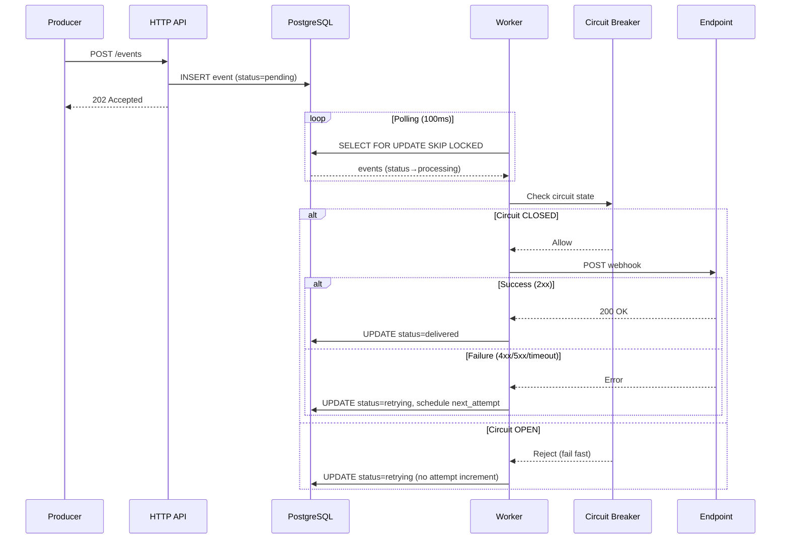
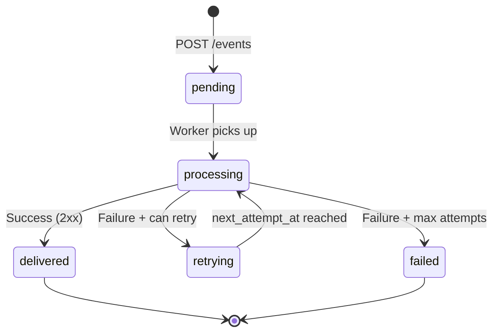
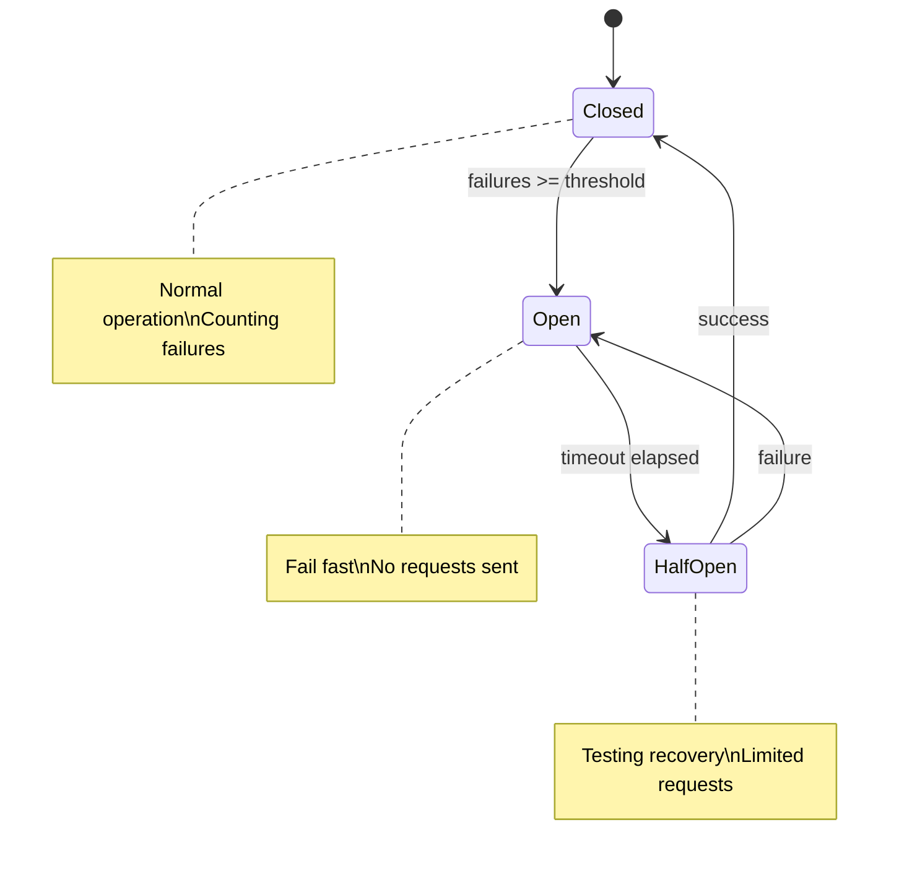

# Projeto 1: Webhook Dispatcher

> **Nome sugerido:** `dispatch` ou `hookd`

## Visão Geral

Serviço HTTP em Go para entrega confiável de webhooks com retry, backpressure e observabilidade completa.

**Inspiração:** Projetos como hook0 (Rust), mas focado em simplicidade e Go idiomático.

## Escopo (MVP)

### O que FAZ

- Recebe eventos via HTTP API
- Persiste eventos em PostgreSQL (durabilidade garantida)
- Entrega webhooks para endpoints configurados
- Retry com backoff exponencial + jitter
- Rate limiting por destino
- Circuit breaker por destino
- Idempotência (deduplicação por event ID)
- Métricas Prometheus
- Graceful shutdown

### O que NÃO FAZ (v1)

- Multi-tenancy
- Autenticação/autorização complexa
- Clustering/distribuição (mas arquitetura permite escalar horizontalmente)
- UI/Dashboard
- Transformação de payload

> *Escopo pequeno, execução profunda.*

## Arquitetura

### Visão Geral do Sistema



### Fluxo de Processamento de Evento



### Estados do Evento



### Circuit Breaker States



## API (OpenAPI-first)

### Endpoints

| Método | Path | Descrição |
|--------|------|-----------|
| `POST` | `/events` | Recebe evento para dispatch |
| `GET` | `/events/{id}` | Status de um evento |
| `GET` | `/events/{id}/attempts` | Histórico de tentativas |
| `POST` | `/subscriptions` | Registra endpoint destino |
| `GET` | `/subscriptions` | Lista subscriptions |
| `DELETE` | `/subscriptions/{id}` | Remove subscription |
| `GET` | `/health` | Health check |
| `GET` | `/metrics` | Prometheus metrics |

### Exemplo de Payload

```json
// POST /events
{
  "id": "evt_abc123",           // idempotency key
  "type": "order.created",
  "source": "billing-service",
  "data": {
    "order_id": "12345",
    "amount": 99.90
  }
}

// Response
{
  "id": "evt_abc123",
  "status": "queued",
  "created_at": "2026-01-11T16:00:00Z"
}
```

## Contrato de Entrega

### Definição de Sucesso e Falha

| Resultado | Condição | Ação |
|-----------|----------|------|
| **Sucesso** | HTTP status `2xx` (200-299) | Evento marcado como `delivered` |
| **Falha** | HTTP status `4xx`, `5xx` | Incrementa `attempts`, agenda retry |
| **Falha** | Timeout (default: 30s) | Incrementa `attempts`, agenda retry |
| **Falha** | Erro de conexão (DNS, TCP, TLS) | Incrementa `attempts`, agenda retry |
| **Falha** | Circuit breaker aberto | **NÃO** incrementa `attempts`, agenda retry |

### Requisitos para Endpoints (Subscriptions)

Os endpoints registrados **devem**:
- Responder com `2xx` para indicar recebimento bem-sucedido
- Responder em até 30 segundos (timeout configurável)
- Ser idempotentes (podem receber o mesmo evento mais de uma vez)

### Payload Enviado ao Endpoint

```http
POST {subscription.url}
Content-Type: application/json
X-Dispatch-Event-ID: evt_abc123
X-Dispatch-Event-Type: order.created
X-Dispatch-Timestamp: 1736625600
X-Dispatch-Signature: sha256=abc123...  # HMAC do body com subscription.secret

{
  "id": "evt_abc123",
  "type": "order.created",
  "source": "billing-service",
  "data": {
    "order_id": "12345",
    "amount": 99.90
  },
  "timestamp": "2026-01-11T16:00:00Z"
}
```

---

## Componentes Técnicos

### 1. PostgreSQL Storage

**Schema:**
```sql
CREATE TYPE event_status AS ENUM (
    'pending',      -- recém recebido, aguardando processamento
    'processing',   -- worker pegou, está tentando entregar
    'delivered',    -- entrega bem-sucedida
    'retrying',     -- falhou, aguardando próxima tentativa
    'failed'        -- esgotou tentativas, dead letter
);

CREATE TABLE events (
    id              TEXT PRIMARY KEY,
    type            TEXT NOT NULL,
    source          TEXT NOT NULL,
    data            JSONB NOT NULL,
    status          event_status NOT NULL DEFAULT 'pending',
    attempts        INT NOT NULL DEFAULT 0,
    max_attempts    INT NOT NULL DEFAULT 5,
    next_attempt_at TIMESTAMPTZ,
    last_error      TEXT,
    created_at      TIMESTAMPTZ NOT NULL DEFAULT NOW(),
    updated_at      TIMESTAMPTZ NOT NULL DEFAULT NOW(),
    delivered_at    TIMESTAMPTZ
);

CREATE TABLE delivery_attempts (
    id              SERIAL PRIMARY KEY,
    event_id        TEXT NOT NULL REFERENCES events(id),
    attempt_number  INT NOT NULL,
    status_code     INT,
    response_body   TEXT,
    error           TEXT,
    duration_ms     INT,
    created_at      TIMESTAMPTZ NOT NULL DEFAULT NOW()
);

CREATE TABLE subscriptions (
    id              TEXT PRIMARY KEY,
    url             TEXT NOT NULL,
    event_types     TEXT[] NOT NULL,  -- filtro por tipo de evento
    secret          TEXT,             -- para HMAC signature
    rate_limit      INT DEFAULT 100,  -- requests/segundo
    created_at      TIMESTAMPTZ NOT NULL DEFAULT NOW(),
    active          BOOLEAN NOT NULL DEFAULT TRUE
);

-- Índice para workers buscarem eventos pendentes
CREATE INDEX idx_events_pending ON events(next_attempt_at) 
    WHERE status IN ('pending', 'retrying');

-- Índice para idempotência (busca rápida por ID)
CREATE INDEX idx_events_created ON events(created_at);
```

**Trade-offs documentados (ADR):**
- Postgres vs. queue dedicada (RabbitMQ, Redis)
- Escolha: Postgres para simplicidade operacional e durabilidade
- Polling vs. LISTEN/NOTIFY → Polling com `FOR UPDATE SKIP LOCKED`
- Limitação: latência mínima = intervalo de polling (~100ms)

### 2. Worker Pool com Polling

```go
type WorkerPool struct {
    workers       int
    db            *pgxpool.Pool
    httpClient    *http.Client
    pollInterval  time.Duration  // default: 100ms
    batchSize     int            // default: 10
    ctx           context.Context
}

// Query para pegar eventos com lock exclusivo
const fetchEventsQuery = `
    UPDATE events 
    SET status = 'processing', updated_at = NOW()
    WHERE id IN (
        SELECT id FROM events 
        WHERE status IN ('pending', 'retrying') 
          AND (next_attempt_at IS NULL OR next_attempt_at <= NOW())
        ORDER BY next_attempt_at NULLS FIRST
        LIMIT $1
        FOR UPDATE SKIP LOCKED
    )
    RETURNING *
`
```

**Características:**
- Número configurável de workers
- `FOR UPDATE SKIP LOCKED` evita contention entre workers
- Context propagation para cancelamento
- Graceful shutdown (aguarda workers finalizarem)
- Múltiplas instâncias podem rodar em paralelo (escala horizontal)

### 3. Retry com Backoff

```go
type RetryPolicy struct {
    MaxAttempts     int           // default: 5
    InitialInterval time.Duration // default: 1s
    MaxInterval     time.Duration // default: 1h
    Multiplier      float64       // default: 2.0
    Jitter          float64       // default: 0.1
}
```

**Fórmula:**
```
delay = min(initialInterval * (multiplier ^ attempt) + jitter, maxInterval)
```

### 4. Rate Limiter por Destino

```go
type RateLimiter struct {
    limiters map[string]*rate.Limiter // per-subscription
    mu       sync.RWMutex
}
```

**Trade-off:** Token bucket vs. sliding window → Token bucket (stdlib `rate.Limiter`)

### 5. Circuit Breaker por Destino

**Lib:** `sony/gobreaker` — madura, testada, bem mantida.

```go
import "github.com/sony/gobreaker/v2"

type SubscriptionBreakers struct {
    breakers map[string]*gobreaker.CircuitBreaker[*http.Response]
    mu       sync.RWMutex
}

// Configuração por subscription
func newBreaker(subscriptionID string) *gobreaker.CircuitBreaker[*http.Response] {
    return gobreaker.NewCircuitBreaker[*http.Response](gobreaker.Settings{
        Name:        subscriptionID,
        MaxRequests: 3,                    // requests permitidos em half-open
        Interval:    10 * time.Second,     // janela para contar falhas
        Timeout:     30 * time.Second,     // tempo em open antes de half-open
        ReadyToTrip: func(counts gobreaker.Counts) bool {
            return counts.ConsecutiveFailures >= 5
        },
        OnStateChange: func(name string, from, to gobreaker.State) {
            slog.Info("circuit breaker state change",
                "subscription", name,
                "from", from.String(),
                "to", to.String(),
            )
        },
    })
}
```

**Comportamento:**
- **Closed:** opera normalmente, conta falhas consecutivas
- **Open:** rejeita imediatamente, evita sobrecarregar destino com problemas
- **Half-Open:** após timeout, permite alguns requests para testar recuperação

**Decisão crítica — Circuito aberto NÃO consome tentativa do evento:**
```go
func (w *Worker) deliver(event Event, sub Subscription) error {
    breaker := w.breakers.Get(sub.ID)
    
    _, err := breaker.Execute(func() (*http.Response, error) {
        return w.httpClient.Do(req)
    })
    
    if errors.Is(err, gobreaker.ErrOpenState) {
        // Circuito aberto: NÃO incrementa attempts
        // Evento volta para 'retrying' com next_attempt_at
        return w.rescheduleWithoutAttemptIncrement(event)
    }
    
    if err != nil {
        // Falha real: incrementa attempts
        return w.recordFailedAttempt(event, err)
    }
    
    return w.recordSuccess(event)
}
```

**Trade-offs documentados (ADR):**

| Decisão | Escolha | Justificativa |
|---------|---------|---------------|
| Lib vs própria | `sony/gobreaker` | Madura, edge cases resolvidos, foco no que importa |
| Granularidade | Por subscription | Problema em um destino não afeta outros |
| Estado | In-memory | Simplicidade; reconstrói rápido após restart |
| Circuito aberto | Não consome tentativa | Problema é do destino, não do evento |

### 6. Idempotência

- Event ID como PRIMARY KEY no Postgres
- INSERT com `ON CONFLICT DO NOTHING`
- Retorna evento existente se já processado

```go
const insertEventQuery = `
    INSERT INTO events (id, type, source, data)
    VALUES ($1, $2, $3, $4)
    ON CONFLICT (id) DO NOTHING
    RETURNING *
`
```

## Estrutura do Projeto

```
dispatch/
├── cmd/
│   └── dispatch/
│       └── main.go
├── internal/
│   ├── api/              # HTTP handlers
│   │   ├── handler.go
│   │   ├── middleware.go
│   │   └── routes.go
│   ├── storage/          # PostgreSQL repository
│   │   ├── postgres.go
│   │   ├── postgres_test.go
│   │   └── migrations/
│   │       └── 001_initial.sql
│   ├── worker/           # Worker pool
│   │   ├── pool.go
│   │   ├── pool_test.go
│   │   └── delivery.go
│   ├── retry/            # Retry/backoff logic
│   │   ├── policy.go
│   │   └── policy_test.go
│   ├── ratelimit/        # Rate limiting
│   │   ├── limiter.go
│   │   └── limiter_test.go
│   ├── circuitbreaker/   # Circuit breaker
│   │   ├── breaker.go
│   │   └── breaker_test.go
│   └── observability/    # Metrics, logging
│       ├── metrics.go
│       └── logging.go
├── api/
│   └── openapi.yaml      # OpenAPI spec
├── docs/
│   └── adr/
│       ├── 001-why-go.md
│       ├── 002-postgres-storage.md
│       ├── 003-retry-strategy.md
│       ├── 004-rate-limiting.md
│       ├── 005-circuit-breaker.md
│       └── 006-polling-vs-notify.md
├── scripts/
│   ├── load-test.sh
│   └── demo.sh
├── Makefile
├── Dockerfile
├── docker-compose.yaml   # dispatch + postgres + prometheus + grafana
├── README.md
├── CHANGELOG.md
└── go.mod
```

## Estratégia de Testes

### Princípios

1. **Test-Driven Development (TDD)** — escrever testes antes da implementação
2. **Design for Testability** — interfaces e injeção de dependência facilitam mocks
3. **Testes como documentação** — testes descrevem o comportamento esperado
4. **Fail fast** — CI bloqueia merge se testes falham

### Design para Testabilidade

**Interfaces para dependências externas:**
```go
// Permite mock do banco em testes unitários
type EventRepository interface {
    Create(ctx context.Context, event Event) error
    GetPending(ctx context.Context, limit int) ([]Event, error)
    UpdateStatus(ctx context.Context, id string, status EventStatus) error
    RecordAttempt(ctx context.Context, attempt DeliveryAttempt) error
}

// Permite mock do HTTP client em testes unitários
type HTTPClient interface {
    Do(req *http.Request) (*http.Response, error)
}

// Permite mock do clock para testes de retry/backoff
type Clock interface {
    Now() time.Time
    After(d time.Duration) <-chan time.Time
}
```

**Injeção de dependência:**
```go
type Worker struct {
    repo       EventRepository  // interface, não implementação
    httpClient HTTPClient       // interface, não *http.Client
    clock      Clock            // interface, não time.Now()
    breakers   BreakerRegistry
    rateLimiter RateLimiterRegistry
}

// Construtor aceita interfaces
func NewWorker(repo EventRepository, client HTTPClient, clock Clock) *Worker
```

### Pirâmide de Testes

```
        ┌─────────┐
        │  E2E    │  ← Poucos, lentos, validam fluxo completo
       ─┴─────────┴─
      ┌─────────────┐
      │ Integration │  ← Testcontainers (Postgres real)
     ─┴─────────────┴─
    ┌─────────────────┐
    │   Unit Tests    │  ← Muitos, rápidos, mocks
   ─┴─────────────────┴─
```

### Testes Unitários

**O que testar:**
- Lógica de retry/backoff (cálculo de delays)
- Circuit breaker (transições de estado)
- Rate limiter (permite/bloqueia)
- Validação de payloads
- Handlers HTTP (request/response)

**Exemplo — Retry Policy:**
```go
func TestRetryPolicy_CalculateDelay(t *testing.T) {
    policy := RetryPolicy{
        InitialInterval: 1 * time.Second,
        MaxInterval:     1 * time.Hour,
        Multiplier:      2.0,
    }
    
    tests := []struct {
        attempt  int
        expected time.Duration
    }{
        {1, 1 * time.Second},
        {2, 2 * time.Second},
        {3, 4 * time.Second},
        {4, 8 * time.Second},
        {5, 16 * time.Second},
    }
    
    for _, tt := range tests {
        t.Run(fmt.Sprintf("attempt_%d", tt.attempt), func(t *testing.T) {
            got := policy.CalculateDelay(tt.attempt)
            // Permite variação por jitter
            assert.InDelta(t, tt.expected, got, float64(tt.expected)*0.2)
        })
    }
}
```

**Exemplo — Worker com mocks:**
```go
func TestWorker_DeliverSuccess(t *testing.T) {
    // Arrange
    mockRepo := &MockEventRepository{}
    mockClient := &MockHTTPClient{
        Response: &http.Response{StatusCode: 200},
    }
    mockClock := &MockClock{now: time.Now()}
    
    worker := NewWorker(mockRepo, mockClient, mockClock)
    event := Event{ID: "evt_123", Status: StatusPending}
    
    // Act
    err := worker.Deliver(context.Background(), event)
    
    // Assert
    assert.NoError(t, err)
    assert.Equal(t, StatusDelivered, mockRepo.LastUpdatedStatus)
}

func TestWorker_DeliverFailure_SchedulesRetry(t *testing.T) {
    // Arrange
    mockRepo := &MockEventRepository{}
    mockClient := &MockHTTPClient{
        Response: &http.Response{StatusCode: 500},
    }
    
    worker := NewWorker(mockRepo, mockClient, &MockClock{})
    event := Event{ID: "evt_123", Attempts: 0, MaxAttempts: 5}
    
    // Act
    err := worker.Deliver(context.Background(), event)
    
    // Assert
    assert.Error(t, err)
    assert.Equal(t, StatusRetrying, mockRepo.LastUpdatedStatus)
    assert.Equal(t, 1, mockRepo.LastAttemptCount)
}
```

### Testes de Integração

**Ferramentas:**
- `testcontainers-go` — Postgres real em container
- `httptest` — servidor HTTP fake para simular endpoints

**Exemplo — Repository com Postgres real:**
```go
func TestEventRepository_Integration(t *testing.T) {
    if testing.Short() {
        t.Skip("skipping integration test")
    }
    
    // Setup container
    ctx := context.Background()
    postgres, err := testcontainers.GenericContainer(ctx, testcontainers.GenericContainerRequest{
        ContainerRequest: testcontainers.ContainerRequest{
            Image:        "postgres:16-alpine",
            ExposedPorts: []string{"5432/tcp"},
            Env: map[string]string{
                "POSTGRES_DB":       "dispatch_test",
                "POSTGRES_PASSWORD": "test",
            },
            WaitingFor: wait.ForListeningPort("5432/tcp"),
        },
        Started: true,
    })
    require.NoError(t, err)
    defer postgres.Terminate(ctx)
    
    // Run migrations
    connStr := getConnectionString(postgres)
    repo := NewPostgresRepository(connStr)
    
    // Test
    event := Event{ID: "evt_test", Type: "test.event", Data: json.RawMessage(`{}`)}
    err = repo.Create(ctx, event)
    assert.NoError(t, err)
    
    // Verify idempotency
    err = repo.Create(ctx, event)
    assert.NoError(t, err) // ON CONFLICT DO NOTHING
}
```

**Exemplo — Delivery end-to-end:**
```go
func TestDelivery_EndToEnd(t *testing.T) {
    // Fake endpoint que recebe webhooks
    received := make(chan Event, 1)
    endpoint := httptest.NewServer(http.HandlerFunc(func(w http.ResponseWriter, r *http.Request) {
        var event Event
        json.NewDecoder(r.Body).Decode(&event)
        received <- event
        w.WriteHeader(http.StatusOK)
    }))
    defer endpoint.Close()
    
    // Setup dispatcher com Postgres real
    // ...
    
    // Create subscription pointing to fake endpoint
    sub := Subscription{URL: endpoint.URL, EventTypes: []string{"test.*"}}
    
    // Send event
    event := Event{ID: "evt_e2e", Type: "test.created"}
    
    // Assert delivery
    select {
    case got := <-received:
        assert.Equal(t, event.ID, got.ID)
    case <-time.After(5 * time.Second):
        t.Fatal("timeout waiting for delivery")
    }
}
```

### Testes de Concorrência

```go
func TestWorkerPool_ConcurrentDelivery(t *testing.T) {
    // Verifica que múltiplos workers não pegam o mesmo evento
    // Usa -race flag para detectar data races
}

func TestCircuitBreaker_ConcurrentAccess(t *testing.T) {
    // Verifica thread-safety do circuit breaker
}
```

### CI Pipeline

```yaml
# .github/workflows/ci.yaml
jobs:
  test:
    runs-on: ubuntu-latest
    steps:
      - uses: actions/checkout@v4
      
      - name: Unit Tests
        run: go test -race -short ./...
      
      - name: Integration Tests
        run: go test -race -run Integration ./...
      
      - name: Coverage
        run: go test -coverprofile=coverage.out ./...
      
      - name: Lint
        uses: golangci/golangci-lint-action@v3
```

---

## ADRs Planejados

| ADR | Título | Decisão Principal |
|-----|--------|-------------------|
| 001 | Por que Go | Performance, concorrência nativa, deploy simples |
| 002 | PostgreSQL como Storage | Durabilidade, simplicidade ops, permite escala horizontal |
| 003 | Estratégia de Retry | Exponential backoff + jitter, max 5 tentativas |
| 004 | Rate Limiting | Token bucket por subscription, stdlib rate.Limiter |
| 005 | Circuit Breaker | `sony/gobreaker`, circuito aberto não consome tentativa |
| 006 | Polling vs LISTEN/NOTIFY | Polling com FOR UPDATE SKIP LOCKED, simplicidade |
| 007 | Observabilidade | Prometheus metrics, slog structured logging |
| 008 | Graceful Shutdown | Context cancellation, aguarda workers finalizarem |
| 009 | Estratégia de Testes | TDD, interfaces para mocks, testcontainers |

## Métricas e SLOs

**Targets para load test:**

| Métrica | Target |
|---------|--------|
| Throughput | >1000 events/sec |
| Latência p99 | <100ms (enqueue) |
| Success rate | >99% |
| Memory under load | <256MB |
| Goroutines estáveis | <1000 |

**Comandos de validação:**
```bash
# Load test
make load-test

# Benchmarks
go test -bench=. -benchmem ./...

# Race detector
go test -race ./...

# Coverage
go test -cover ./...
```

## Roadmap

### v0.1.0 — MVP Funcional
Sistema funciona end-to-end: recebe evento, persiste, entrega com retry.

- [ ] OpenAPI spec (api/openapi.yaml)
- [ ] PostgreSQL schema + migrations
- [ ] HTTP API (events, subscriptions, health)
- [ ] Worker pool com polling (`FOR UPDATE SKIP LOCKED`)
- [ ] Retry com backoff exponencial + jitter
- [ ] Idempotência (`ON CONFLICT DO NOTHING`)
- [ ] Contrato de entrega (headers `X-Dispatch-*`, HMAC signature)
- [ ] Graceful shutdown
- [ ] Testes unitários

### v0.2.0 — Observabilidade
Essencial para debugar e validar comportamento antes de adicionar resiliência.

- [ ] Structured logging (`slog`)
- [ ] Prometheus metrics (eventos recebidos, entregues, falhas, latência)
- [ ] Health check endpoint (`/health`, `/ready`)
- [ ] Métricas do circuit breaker e rate limiter

### v0.3.0 — Resiliência
Proteções avançadas para destinos com problemas.

- [ ] Rate limiting por destino (`golang.org/x/time/rate`)
- [ ] Circuit breaker por destino (`sony/gobreaker`)
- [ ] Integration tests com testcontainers

### v1.0.0 — Production-Ready
Polish final e documentação completa.

- [ ] Docker + docker-compose (dispatch + postgres + prometheus + grafana)
- [ ] Load tests documentados (vegeta/k6)
- [ ] Benchmarks no README
- [ ] ADRs completos
- [ ] README técnico final

## Comparação com Alternativas

| Aspecto | hook0 | dispatch |
|---------|-------|----------|
| Linguagem | Rust | Go |
| Foco | Produto completo | Core dispatcher |
| Escopo | Multi-tenant, UI, etc. | Single-tenant, API only |
| Complexidade | Alta | Mínima necessária |
| Documentação | Usuário final | Decisões técnicas (ADRs) |

> *dispatch é uma solução focada e leve para casos onde não se precisa de toda a complexidade de um produto completo.*
