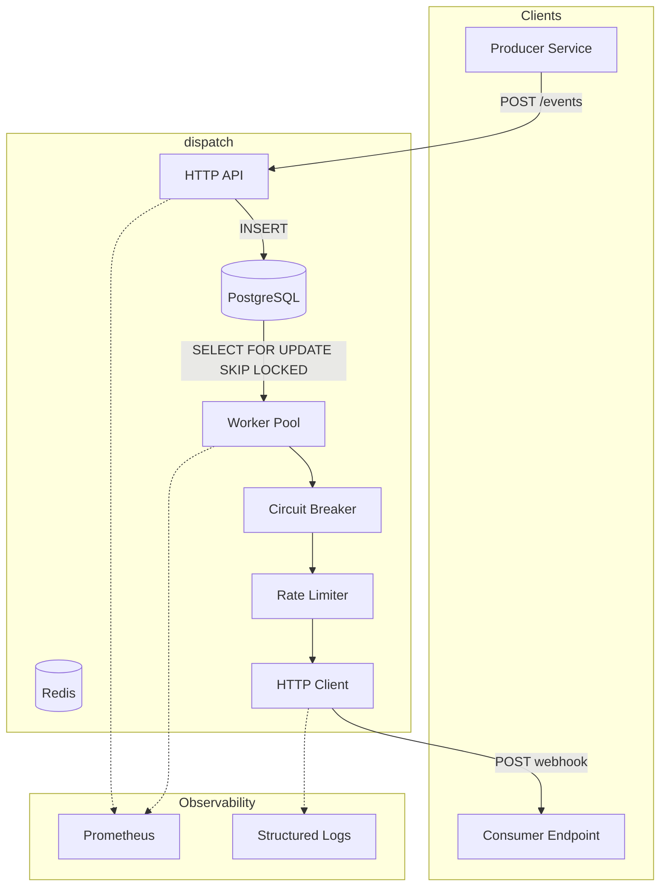
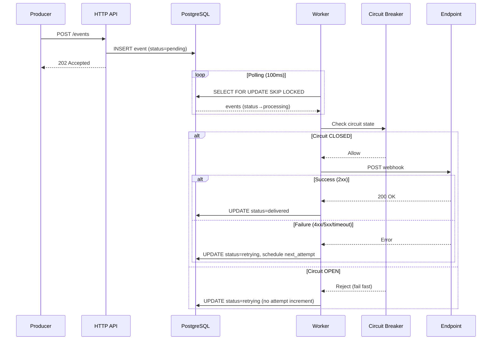
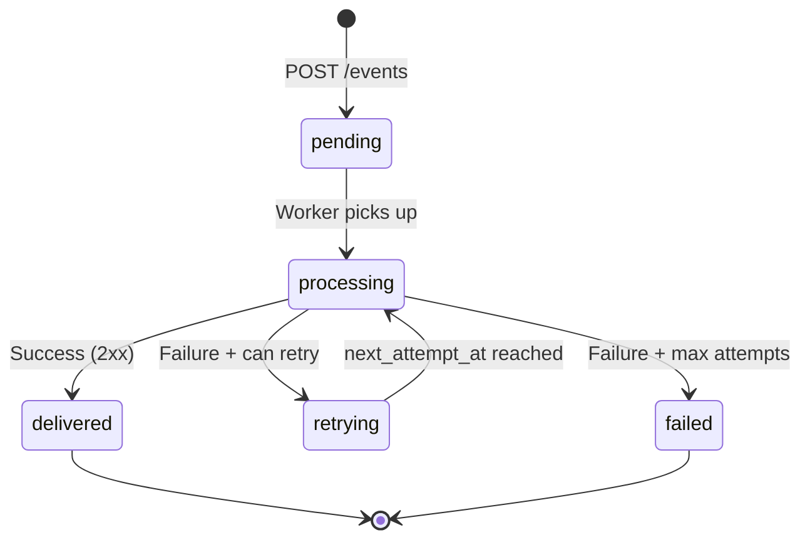
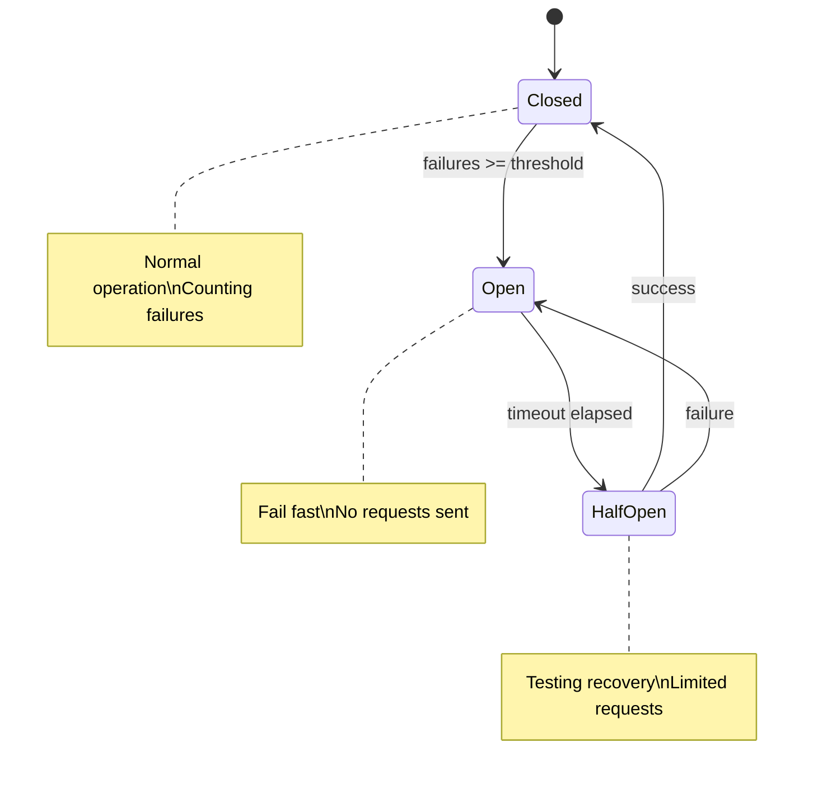

# Webhook Dispatcher

> **Suggested name:** `dispatch` or `hookd`

## Overview

HTTP service in Go for reliable webhook delivery with retry, backpressure, and full observability.

**Inspiration:** Projects like hook0 (Rust), but focused on simplicity and idiomatic Go.

## Scope (MVP)

### What it DOES

- Receives events via HTTP API
- Persists events in PostgreSQL (guaranteed durability)
- Delivers webhooks to configured endpoints
- Retry with exponential backoff + jitter
- Rate limiting per destination (Redis-backed for horizontal scaling)
- Circuit breaker per destination (Redis-backed for horizontal scaling)
- Idempotency (deduplication by event ID)
- Prometheus metrics
- Graceful shutdown

### What it DOES NOT (v1)

- Multi-tenancy
- Complex authentication/authorization
- UI/Dashboard
- Payload transformation

> *Small scope, deep execution.*

## Architecture

### System Overview



### Event Processing Flow



### Event States



### Circuit Breaker States



## API (OpenAPI-first)

### Endpoints

| Method | Path | Description |
|--------|------|-------------|
| `POST` | `/events` | Receive event for dispatch |
| `GET` | `/events/{id}` | Event status |
| `GET` | `/events/{id}/attempts` | Delivery attempts history |
| `POST` | `/subscriptions` | Register destination endpoint |
| `GET` | `/subscriptions` | List subscriptions |
| `DELETE` | `/subscriptions/{id}` | Remove subscription |
| `GET` | `/health` | Health check |
| `GET` | `/metrics` | Prometheus metrics |

### Payload Example

```json
// POST /events
{
  "id": "evt_abc123",           // idempotency key
  "type": "order.created",
  "source": "billing-service",
  "data": {
    "order_id": "12345",
    "amount": 99.90
  }
}

// Response
{
  "id": "evt_abc123",
  "status": "queued",
  "created_at": "2026-01-11T16:00:00Z"
}
```

## Delivery Contract

### Success and Failure Definition

| Result | Condition | Action |
|--------|-----------|--------|
| **Success** | HTTP status `2xx` (200-299) | Event marked as `delivered` |
| **Failure** | HTTP status `4xx`, `5xx` | Increments `attempts`, schedules retry |
| **Failure** | Timeout (default: 30s) | Increments `attempts`, schedules retry |
| **Failure** | Connection error (DNS, TCP, TLS) | Increments `attempts`, schedules retry |
| **Failure** | Circuit breaker open | Does **NOT** increment `attempts`, schedules retry |

### Endpoint Requirements (Subscriptions)

Registered endpoints **must**:
- Respond with `2xx` to indicate successful receipt
- Respond within 30 seconds (configurable timeout)
- Be idempotent (may receive the same event more than once)

### Payload Sent to Endpoint

```http
POST {subscription.url}
Content-Type: application/json
X-Dispatch-Event-ID: evt_abc123
X-Dispatch-Event-Type: order.created
X-Dispatch-Timestamp: 1736625600
X-Dispatch-Signature: sha256=abc123...  # HMAC of body with subscription.secret

{
  "id": "evt_abc123",
  "type": "order.created",
  "source": "billing-service",
  "data": {
    "order_id": "12345",
    "amount": 99.90
  },
  "timestamp": "2026-01-11T16:00:00Z"
}
```

---

## Technical Components

### 1. PostgreSQL Storage

**Schema:**
```sql
CREATE TYPE event_status AS ENUM (
    'pending',      -- just received, awaiting processing
    'processing',   -- worker picked up, attempting delivery
    'delivered',    -- successful delivery
    'retrying',     -- failed, awaiting next attempt
    'failed'        -- exhausted attempts, dead letter
);

CREATE TABLE events (
    id              TEXT PRIMARY KEY,
    type            TEXT NOT NULL,
    source          TEXT NOT NULL,
    data            JSONB NOT NULL,
    status          event_status NOT NULL DEFAULT 'pending',
    attempts        INT NOT NULL DEFAULT 0,
    max_attempts    INT NOT NULL DEFAULT 5,
    next_attempt_at TIMESTAMPTZ,
    last_error      TEXT,
    created_at      TIMESTAMPTZ NOT NULL DEFAULT NOW(),
    updated_at      TIMESTAMPTZ NOT NULL DEFAULT NOW(),
    delivered_at    TIMESTAMPTZ
);

CREATE TABLE delivery_attempts (
    id              SERIAL PRIMARY KEY,
    event_id        TEXT NOT NULL REFERENCES events(id),
    attempt_number  INT NOT NULL,
    status_code     INT,
    response_body   TEXT,
    error           TEXT,
    duration_ms     INT,
    created_at      TIMESTAMPTZ NOT NULL DEFAULT NOW()
);

CREATE TABLE subscriptions (
    id              TEXT PRIMARY KEY,
    url             TEXT NOT NULL,
    event_types     TEXT[] NOT NULL,  -- event type filter
    secret          TEXT,             -- for HMAC signature
    rate_limit      INT DEFAULT 100,  -- requests/second
    created_at      TIMESTAMPTZ NOT NULL DEFAULT NOW(),
    active          BOOLEAN NOT NULL DEFAULT TRUE
);

-- Index for workers to fetch pending events
CREATE INDEX idx_events_pending ON events(next_attempt_at) 
    WHERE status IN ('pending', 'retrying');

-- Index for idempotency (fast lookup by ID)
CREATE INDEX idx_events_created ON events(created_at);
```

**Documented trade-offs (ADR):**
- Postgres vs. dedicated queue (RabbitMQ, Redis)
- Choice: Postgres for operational simplicity and durability

### Redis Schema

Redis is used for distributed rate limiting and circuit breaker state.

**Rate Limiter (Sliding Window):**
```
ratelimit:{subscription_id}  -> Sorted Set
    member: unique request ID (UUID or timestamp)
    score: timestamp (Unix milliseconds)
```

**Circuit Breaker:**
```
cb:{subscription_id}:state       -> String: "closed" | "open" | "half-open"
cb:{subscription_id}:failures    -> String: failure count (current window)
cb:{subscription_id}:successes   -> String: success count (half-open state)
cb:{subscription_id}:opened_at   -> String: timestamp when opened (for timeout)
```

**TTL Strategy:**
- Rate limit keys: TTL = window size (e.g., 1 second)
- Circuit breaker keys: TTL = max(interval, timeout) + buffer

**Connection Configuration:**
```go
type RedisConfig struct {
    Addr         string        // e.g., "localhost:6379"
    Password     string        // optional
    DB           int           // database number
    PoolSize     int           // connection pool size
    ReadTimeout  time.Duration
    WriteTimeout time.Duration
}
```

**Environment Variables:**
```
REDIS_URL=redis://localhost:6379/0
```

**Documented trade-offs (ADR):**
- Polling vs. LISTEN/NOTIFY → Polling with `FOR UPDATE SKIP LOCKED`
- Limitation: minimum latency = polling interval (~100ms)

### 2. Worker Pool with Polling

```go
type WorkerPool struct {
    workers       int
    db            *pgxpool.Pool
    httpClient    *http.Client
    pollInterval  time.Duration  // default: 100ms
    batchSize     int            // default: 10
    ctx           context.Context
}

// Query to fetch events with exclusive lock
const fetchEventsQuery = `
    UPDATE events 
    SET status = 'processing', updated_at = NOW()
    WHERE id IN (
        SELECT id FROM events 
        WHERE status IN ('pending', 'retrying') 
          AND (next_attempt_at IS NULL OR next_attempt_at <= NOW())
        ORDER BY next_attempt_at NULLS FIRST
        LIMIT $1
        FOR UPDATE SKIP LOCKED
    )
    RETURNING *
`
```

**Characteristics:**
- Configurable number of workers
- `FOR UPDATE SKIP LOCKED` avoids contention between workers
- Context propagation for cancellation
- Graceful shutdown (waits for workers to finish)
- Multiple instances can run in parallel (horizontal scaling)

### 3. Retry with Backoff

```go
type RetryPolicy struct {
    MaxAttempts     int           // default: 5
    InitialInterval time.Duration // default: 1s
    MaxInterval     time.Duration // default: 1h
    Multiplier      float64       // default: 2.0
    Jitter          float64       // default: 0.1
}
```

**Formula:**
```
delay = min(initialInterval * (multiplier ^ attempt) + jitter, maxInterval)
```

### 4. Rate Limiter per Destination

**Storage:** Redis (for horizontal scaling)

**Algorithm:** Sliding window counter using Redis sorted sets.

```go
// Interface allows swapping implementations
type RateLimiter interface {
    Allow(ctx context.Context, subscriptionID string, limit int) (bool, error)
}

// Redis implementation using sliding window
type RedisRateLimiter struct {
    client *redis.Client
    window time.Duration // e.g., 1 second
}

func (r *RedisRateLimiter) Allow(ctx context.Context, subID string, limit int) (bool, error) {
    // Uses ZADD + ZREMRANGEBYSCORE + ZCARD in a Lua script
    // Atomic operation, works across multiple instances
}
```

**Fallback:** In-memory `rate.Limiter` when Redis unavailable.

**Trade-off:** Sliding window (Redis) vs. token bucket (in-memory)
- Redis: Precise across instances, ~1-2ms latency
- In-memory: Fast but approximate with multiple instances

### 5. Circuit Breaker per Destination

**Storage:** Redis (for horizontal scaling)

**State:** Stored in Redis hash per subscription.

```go
// Interface allows swapping implementations
type CircuitBreaker interface {
    Allow(ctx context.Context, subscriptionID string) (bool, error)
    RecordSuccess(ctx context.Context, subscriptionID string) error
    RecordFailure(ctx context.Context, subscriptionID string) error
    State(ctx context.Context, subscriptionID string) (State, error)
}

// Redis keys per subscription:
// cb:{subID}:state      -> "closed" | "open" | "half-open"
// cb:{subID}:failures   -> counter
// cb:{subID}:successes  -> counter
// cb:{subID}:last_fail  -> timestamp
```

**Fallback:** In-memory `sony/gobreaker` when Redis unavailable.

**Original in-memory implementation (kept as fallback):**

```go
import "github.com/sony/gobreaker/v2"

type SubscriptionBreakers struct {
    breakers map[string]*gobreaker.CircuitBreaker[*http.Response]
    mu       sync.RWMutex
}

// Configuration per subscription
func newBreaker(subscriptionID string) *gobreaker.CircuitBreaker[*http.Response] {
    return gobreaker.NewCircuitBreaker[*http.Response](gobreaker.Settings{
        Name:        subscriptionID,
        MaxRequests: 3,                    // requests allowed in half-open
        Interval:    10 * time.Second,     // window for counting failures
        Timeout:     30 * time.Second,     // time in open before half-open
        ReadyToTrip: func(counts gobreaker.Counts) bool {
            return counts.ConsecutiveFailures >= 5
        },
        OnStateChange: func(name string, from, to gobreaker.State) {
            slog.Info("circuit breaker state change",
                "subscription", name,
                "from", from.String(),
                "to", to.String(),
            )
        },
    })
}
```

**Behavior:**
- **Closed:** operates normally, counts consecutive failures
- **Open:** rejects immediately, avoids overloading destination with problems
- **Half-Open:** after timeout, allows some requests to test recovery

**Critical decision — Open circuit does NOT consume event attempt:**
```go
func (w *Worker) deliver(event Event, sub Subscription) error {
    breaker := w.breakers.Get(sub.ID)
    
    _, err := breaker.Execute(func() (*http.Response, error) {
        return w.httpClient.Do(req)
    })
    
    if errors.Is(err, gobreaker.ErrOpenState) {
        // Circuit open: does NOT increment attempts
        // Event goes back to 'retrying' with next_attempt_at
        return w.rescheduleWithoutAttemptIncrement(event)
    }
    
    if err != nil {
        // Real failure: increments attempts
        return w.recordFailedAttempt(event, err)
    }
    
    return w.recordSuccess(event)
}
```

**Documented trade-offs (ADR):**

| Decision | Choice | Justification |
|----------|--------|---------------|
| Lib vs custom | `sony/gobreaker` | Mature, edge cases resolved, focus on what matters |
| Granularity | Per subscription | Problem in one destination doesn't affect others |
| State | In-memory | Simplicity; rebuilds quickly after restart |
| Open circuit | Does not consume attempt | Problem is with destination, not event |

### 6. Idempotency

- Event ID as PRIMARY KEY in Postgres
- INSERT with `ON CONFLICT DO NOTHING`
- Returns existing event if already processed

```go
const insertEventQuery = `
    INSERT INTO events (id, type, source, data)
    VALUES ($1, $2, $3, $4)
    ON CONFLICT (id) DO NOTHING
    RETURNING *
`
```

## Project Structure

```
dispatch/
├── cmd/
│   └── dispatch/
│       └── main.go
├── internal/
│   ├── api/              # HTTP handlers
│   │   ├── handler.go
│   │   ├── middleware.go
│   │   └── routes.go
│   ├── storage/          # PostgreSQL repository
│   │   ├── postgres.go
│   │   ├── postgres_test.go
│   │   └── migrations/
│   │       └── 001_initial.sql
│   ├── worker/           # Worker pool
│   │   ├── pool.go
│   │   ├── pool_test.go
│   │   └── delivery.go
│   ├── retry/            # Retry/backoff logic
│   │   ├── policy.go
│   │   └── policy_test.go
│   ├── ratelimit/        # Rate limiting
│   │   ├── limiter.go
│   │   └── limiter_test.go
│   ├── circuitbreaker/   # Circuit breaker
│   │   ├── breaker.go
│   │   └── breaker_test.go
│   └── observability/    # Metrics, logging
│       ├── metrics.go
│       └── logging.go
├── api/
│   └── openapi.yaml      # OpenAPI spec
├── docs/
│   └── adr/
│       ├── 001-why-go.md
│       ├── 002-postgres-storage.md
│       ├── 003-retry-strategy.md
│       ├── 004-rate-limiting.md
│       ├── 005-circuit-breaker.md
│       └── 006-polling-vs-notify.md
├── scripts/
│   ├── load-test.sh
│   └── demo.sh
├── Makefile
├── Dockerfile
├── docker-compose.yaml   # dispatch + postgres + prometheus + grafana
├── README.md
├── CHANGELOG.md
└── go.mod
```

## Testing Strategy

### Principles

1. **Test-Driven Development (TDD)** — write tests before implementation
2. **Design for Testability** — interfaces and dependency injection facilitate mocks
3. **Tests as documentation** — tests describe expected behavior
4. **Fail fast** — CI blocks merge if tests fail

### Design for Testability

**Interfaces for external dependencies:**
```go
// Allows mocking database in unit tests
type EventRepository interface {
    Create(ctx context.Context, event Event) error
    GetPending(ctx context.Context, limit int) ([]Event, error)
    UpdateStatus(ctx context.Context, id string, status EventStatus) error
    RecordAttempt(ctx context.Context, attempt DeliveryAttempt) error
}

// Allows mocking HTTP client in unit tests
type HTTPClient interface {
    Do(req *http.Request) (*http.Response, error)
}

// Allows mocking clock for retry/backoff tests
type Clock interface {
    Now() time.Time
    After(d time.Duration) <-chan time.Time
}
```

**Dependency injection:**
```go
type Worker struct {
    repo       EventRepository  // interface, not implementation
    httpClient HTTPClient       // interface, not *http.Client
    clock      Clock            // interface, not time.Now()
    breakers   BreakerRegistry
    rateLimiter RateLimiterRegistry
}

// Constructor accepts interfaces
func NewWorker(repo EventRepository, client HTTPClient, clock Clock) *Worker
```

### Test Pyramid

```
        ┌─────────┐
        │  E2E    │  ← Few, slow, validate complete flow
       ─┴─────────┴─
      ┌─────────────┐
      │ Integration │  ← Testcontainers (real Postgres)
     ─┴─────────────┴─
    ┌─────────────────┐
    │   Unit Tests    │  ← Many, fast, mocks
   ─┴─────────────────┴─
```

### Unit Tests

**What to test:**
- Retry/backoff logic (delay calculation)
- Circuit breaker (state transitions)
- Rate limiter (allow/block)
- Payload validation
- HTTP handlers (request/response)

**Example — Retry Policy:**
```go
func TestRetryPolicy_CalculateDelay(t *testing.T) {
    policy := RetryPolicy{
        InitialInterval: 1 * time.Second,
        MaxInterval:     1 * time.Hour,
        Multiplier:      2.0,
    }
    
    tests := []struct {
        attempt  int
        expected time.Duration
    }{
        {1, 1 * time.Second},
        {2, 2 * time.Second},
        {3, 4 * time.Second},
        {4, 8 * time.Second},
        {5, 16 * time.Second},
    }
    
    for _, tt := range tests {
        t.Run(fmt.Sprintf("attempt_%d", tt.attempt), func(t *testing.T) {
            got := policy.CalculateDelay(tt.attempt)
            // Allows variation due to jitter
            assert.InDelta(t, tt.expected, got, float64(tt.expected)*0.2)
        })
    }
}
```

**Example — Worker with mocks:**
```go
func TestWorker_DeliverSuccess(t *testing.T) {
    // Arrange
    mockRepo := &MockEventRepository{}
    mockClient := &MockHTTPClient{
        Response: &http.Response{StatusCode: 200},
    }
    mockClock := &MockClock{now: time.Now()}
    
    worker := NewWorker(mockRepo, mockClient, mockClock)
    event := Event{ID: "evt_123", Status: StatusPending}
    
    // Act
    err := worker.Deliver(context.Background(), event)
    
    // Assert
    assert.NoError(t, err)
    assert.Equal(t, StatusDelivered, mockRepo.LastUpdatedStatus)
}

func TestWorker_DeliverFailure_SchedulesRetry(t *testing.T) {
    // Arrange
    mockRepo := &MockEventRepository{}
    mockClient := &MockHTTPClient{
        Response: &http.Response{StatusCode: 500},
    }
    
    worker := NewWorker(mockRepo, mockClient, &MockClock{})
    event := Event{ID: "evt_123", Attempts: 0, MaxAttempts: 5}
    
    // Act
    err := worker.Deliver(context.Background(), event)
    
    // Assert
    assert.Error(t, err)
    assert.Equal(t, StatusRetrying, mockRepo.LastUpdatedStatus)
    assert.Equal(t, 1, mockRepo.LastAttemptCount)
}
```

### Integration Tests

**Tools:**
- `testcontainers-go` — Real Postgres in container
- `httptest` — Fake HTTP server to simulate endpoints

**Example — Repository with real Postgres:**
```go
func TestEventRepository_Integration(t *testing.T) {
    if testing.Short() {
        t.Skip("skipping integration test")
    }
    
    // Setup container
    ctx := context.Background()
    postgres, err := testcontainers.GenericContainer(ctx, testcontainers.GenericContainerRequest{
        ContainerRequest: testcontainers.ContainerRequest{
            Image:        "postgres:16-alpine",
            ExposedPorts: []string{"5432/tcp"},
            Env: map[string]string{
                "POSTGRES_DB":       "dispatch_test",
                "POSTGRES_PASSWORD": "test",
            },
            WaitingFor: wait.ForListeningPort("5432/tcp"),
        },
        Started: true,
    })
    require.NoError(t, err)
    defer postgres.Terminate(ctx)
    
    // Run migrations
    connStr := getConnectionString(postgres)
    repo := NewPostgresRepository(connStr)
    
    // Test
    event := Event{ID: "evt_test", Type: "test.event", Data: json.RawMessage(`{}`)}
    err = repo.Create(ctx, event)
    assert.NoError(t, err)
    
    // Verify idempotency
    err = repo.Create(ctx, event)
    assert.NoError(t, err) // ON CONFLICT DO NOTHING
}
```

**Example — Delivery end-to-end:**
```go
func TestDelivery_EndToEnd(t *testing.T) {
    // Fake endpoint that receives webhooks
    received := make(chan Event, 1)
    endpoint := httptest.NewServer(http.HandlerFunc(func(w http.ResponseWriter, r *http.Request) {
        var event Event
        json.NewDecoder(r.Body).Decode(&event)
        received <- event
        w.WriteHeader(http.StatusOK)
    }))
    defer endpoint.Close()
    
    // Setup dispatcher with real Postgres
    // ...
    
    // Create subscription pointing to fake endpoint
    sub := Subscription{URL: endpoint.URL, EventTypes: []string{"test.*"}}
    
    // Send event
    event := Event{ID: "evt_e2e", Type: "test.created"}
    
    // Assert delivery
    select {
    case got := <-received:
        assert.Equal(t, event.ID, got.ID)
    case <-time.After(5 * time.Second):
        t.Fatal("timeout waiting for delivery")
    }
}
```

### Concurrency Tests

```go
func TestWorkerPool_ConcurrentDelivery(t *testing.T) {
    // Verifies that multiple workers don't pick up the same event
    // Uses -race flag to detect data races
}

func TestCircuitBreaker_ConcurrentAccess(t *testing.T) {
    // Verifies thread-safety of circuit breaker
}
```

### CI Pipeline

```yaml
# .github/workflows/ci.yaml
jobs:
  test:
    runs-on: ubuntu-latest
    steps:
      - uses: actions/checkout@v4
      
      - name: Unit Tests
        run: go test -race -short ./...
      
      - name: Integration Tests
        run: go test -race -run Integration ./...
      
      - name: Coverage
        run: go test -coverprofile=coverage.out ./...
      
      - name: Lint
        uses: golangci/golangci-lint-action@v3
```

---

## ADRs ✅

| ADR | Title | Main Decision |
|-----|-------|---------------|
| [001](adr/001-why-go.md) | Why Go | Performance, native concurrency, simple deploy |
| [002](adr/002-postgresql-storage.md) | PostgreSQL as Storage | Durability, ops simplicity, allows horizontal scaling |
| [003](adr/003-retry-strategy.md) | Retry Strategy | Exponential backoff + jitter, max 5 attempts |
| [004](adr/004-rate-limiting.md) | Rate Limiting | Token bucket per subscription, stdlib rate.Limiter |
| [005](adr/005-circuit-breaker.md) | Circuit Breaker | `sony/gobreaker`, open circuit does not consume attempt |
| [006](adr/006-polling-vs-listen-notify.md) | Polling vs LISTEN/NOTIFY | Polling with FOR UPDATE SKIP LOCKED, simplicity |
| [007](adr/007-observability.md) | Observability | Prometheus metrics, slog structured logging |
| [008](adr/008-graceful-shutdown.md) | Graceful Shutdown | Context cancellation, waits for workers to finish |
| [009](adr/009-testing-strategy.md) | Testing Strategy | TDD, interfaces for mocks, testcontainers |
| [010](adr/010-library-choices.md) | Library Choices | chi, pgx, prometheus, gobreaker, rate, slog |
| [011](adr/011-redis-horizontal-scaling.md) | Redis for Horizontal Scaling | Distributed rate limiting and circuit breaker |

## Metrics and SLOs

**Load test targets:**

| Metric | Target |
|---------|--------|
| Throughput | >1000 events/sec |
| Latency p99 | <100ms (enqueue) |
| Success rate | >99% |
| Memory under load | <256MB |
| Stable goroutines | <1000 |

**Validation commands:**
```bash
# Load test
make load-test

# Benchmarks
go test -bench=. -benchmem ./...

# Race detector
go test -race ./...

# Coverage
go test -cover ./...
```

## Roadmap

### v0.1.0 — Functional MVP ✅
System works end-to-end: receives event, persists, delivers with retry.

- [x] PostgreSQL schema + migrations
- [x] HTTP API (events, subscriptions, health)
- [x] Worker pool with polling (`FOR UPDATE SKIP LOCKED`)
- [x] Retry with exponential backoff + jitter
- [x] Idempotency (`ON CONFLICT DO NOTHING`)
- [x] Delivery contract (headers `X-Dispatch-*`, HMAC signature)
- [x] Graceful shutdown
- [x] Unit tests

### v0.2.0 — Observability ✅
Essential for debugging and validating behavior before adding resilience.

- [x] Structured logging (`slog`) with context propagation
- [x] Prometheus metrics (events received, delivered, failed, latency)
- [x] Health check endpoints (`/health`, `/ready`)

### v0.3.0 — Resilience (In-Memory) ✅
Advanced protections for problematic destinations (single-instance).

- [x] Rate limiting per destination (`golang.org/x/time/rate`)
- [x] Circuit breaker per destination (`sony/gobreaker`)
- [x] Prometheus metrics for circuit breaker and rate limiter
- [x] Per-subscription configurable rate limits

### v0.4.0 — Horizontal Scaling ✅
Redis-backed resilience for multi-instance deployments.

- [x] Redis-backed rate limiting (custom sliding window with Lua scripts)
- [x] Redis-backed circuit breaker state
- [x] Graceful fallback to in-memory when Redis unavailable
- [x] Redis connection in docker-compose
- [ ] Integration tests with testcontainers (Redis + PostgreSQL)

### v1.0.0 — Production-Ready
Final polish and complete documentation.

- [x] Docker + docker-compose (dispatch + postgres + prometheus + grafana)
- [x] Complete ADRs (library choices)
- [x] Final technical README
- [x] Code documentation (package docs, struct docs, key function docs)
- [ ] Documented load tests (vegeta/k6)
- [ ] Benchmarks in README

## Comparison with Alternatives

| Aspect | hook0 | dispatch |
|--------|-------|----------|
| Language | Rust | Go |
| Focus | Complete product | Core dispatcher |
| Scope | Multi-tenant, UI, etc. | Single-tenant, API only |
| Complexity | High | Minimum necessary |
| Documentation | End user | Technical decisions (ADRs) |

> *dispatch is a focused and lightweight solution for cases where you don't need all the complexity of a complete product.*
